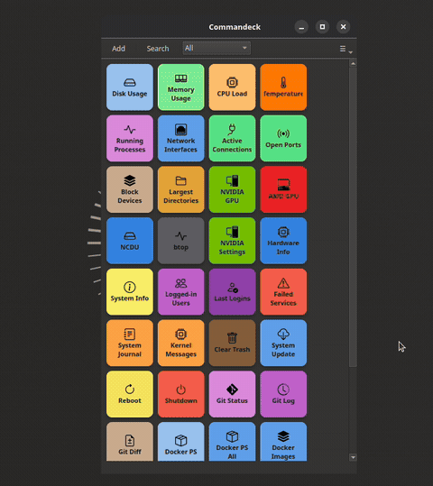

# Commandeck

**Your AI gives you the commands. Commandeck remembers them.**

Commandeck is a desktop app for **Windows, macOS and Linux** that turns commands into
clickable buttons. Click one — it runs on your machine, or on your home server over SSH,
and shows the output. No terminal required.

[](https://github.com/neurocontrarian/commandeck/releases/latest)
[](https://github.com/neurocontrarian/commandeck/releases)
[](LICENSE)


[](https://raw.githubusercontent.com/neurocontrarian/commandeck/main/docs/assets/Commandeck-Demo-01.mp4)
*▶ Click to watch the demo*

**[Documentation](https://commandeck.app)** ·
**[Download](https://github.com/neurocontrarian/commandeck/releases/latest)** ·
**[Get Pro →](https://neurocontrarian.lemonsqueezy.com/checkout/buy/9c16845a-8ab6-4a36-b8da-9874d9d64f33)**

---

## Built your home server with an AI's help?

You're not alone. A NAS, a media server, home automation, a mini-PC running Docker —
these days half of it gets set up by asking ChatGPT or Claude what to type. It works
great… until three weeks later, when a container needs restarting and you're digging
through old AI conversations for that one command.

**Commandeck is where those commands live.** Paste each one into a button once —
"Restart Jellyfin", "Update the stack", "Check disk space" — and from then on it's one
click from the Windows or Mac desktop you actually use. The command runs on your server
over SSH and the output appears in a window.

- No terminal, no re-asking the AI, no copy-paste roulette
- Confirmation prompt on the risky ones
- One button can target several machines at once
- Free, signed **button packs** from an in-app gallery — install, update or remove several at once
- A native **Android app** is in closed testing — the same buttons from your phone

And if you use an AI assistant that speaks [MCP](https://modelcontextprotocol.io), it can
create the buttons *for* you: "add a button that restarts nginx" → the button appears in
your grid.

---

## New to the terminal?

Memorizing commands is tedious. Commandeck ships with **ready-to-use buttons** the moment
you install it — check disk space, update your system, reboot — no setup, no configuration.

When you're ready to go further, creating your own button takes 30 seconds: paste a
command, give it a name, pick an icon. That's it.

---

## Managing several machines?

Commandeck turns your SSH routine into one-click operations.

- Run the same command across multiple machines with a single click
- Add a host once; pick the target at click time; key copy handled in-app
- Organize buttons by host, environment, or task
- Output in a clean dialog, or directly in a terminal

If you live in the terminal, Commandeck doesn't replace it — it handles the repetitive
parts so you can focus on what actually needs thinking.

---

## Try Pro free for 14 days

Commandeck's core is **free and open source (AGPLv3)** — unlimited local commands and
buttons, no account, no telemetry, no expiry.

Everything server-related lives in **Pro: $29, one-time — buy once, yours for good.**
**The trial needs no card and no email** — download the Pro build, launch it, and every
feature is unlocked for 14 days.

| | Free | Pro |
|--|------|-----|
| Local command execution | Unlimited | Unlimited |
| Custom buttons | Unlimited | Unlimited |
| Default buttons (use, edit, delete) | ✓ | ✓ |
| SSH machines | — | Unlimited |
| Multi-machine buttons | — | ✓ |
| Multi-select + group actions | — | ✓ |
| Button themes | 1 (Bold) | 6 + custom CSS |
| Config backup / restore | — | ✓ |
| MCP server (AI integration) | — | ✓ |

**[Get a Pro license →](https://neurocontrarian.lemonsqueezy.com/checkout/buy/9c16845a-8ab6-4a36-b8da-9874d9d64f33)**

### Why a paid Pro tier?

Commandeck is built and maintained by one person. The free tier is genuinely useful and
will stay free. Pro licenses fund new features, multi-platform testing, documentation,
and keeping everything working across OS updates. It's a one-time purchase, not a
subscription — and your buttons are plain text files on your own machine, so there's no
cloud, no account, and no lock-in either way.

---

## Shaped by the community

The buttons that ship with Commandeck came from real workflows. As users share what
they've added, the most useful commands become part of the default set — so every new
user starts with a better toolkit.

**Have a command worth sharing?** Drop it in
[Discussions](https://github.com/neurocontrarian/commandeck/discussions) — the criteria
are simple: works reliably, clearly useful, produces readable output.

---

## Installation

> **The latest version for every platform is always here:
> [github.com/neurocontrarian/commandeck/releases/latest](https://github.com/neurocontrarian/commandeck/releases/latest)**
> That link never changes — bookmark it. Each release page lists Linux, macOS and
> Windows files together. Download the one for your system.

All **Pro** builds include a **14-day free trial** — no account, no card required.
The trial starts automatically on first launch.

### Windows (x86_64)

| File | When to use |
|------|-------------|
| `Commandeck-VERSION-Windows-x64.exe` | **Free** — Inno Setup installer (Start menu shortcut + uninstaller). |
| `Commandeck-Pro-VERSION-Windows-x64.exe` | **Pro** installer. 14-day trial included. |

The installer is **not yet code-signed**, so SmartScreen may warn: click
**More info → Run anyway**.

### macOS (Apple Silicon)

| File | When to use |
|------|-------------|
| `Commandeck-VERSION-macOS-AppleSilicon.dmg` | **Free.** |
| `Commandeck-Pro-VERSION-macOS-AppleSilicon.dmg` | **Pro.** 14-day trial included. |

The app is **not yet code-signed**, so on first launch macOS Gatekeeper will block it.
Right-click the app → **Open** (then confirm), or run
`xattr -dr com.apple.quarantine /Applications/Commandeck.app`.

### Linux (AppImage)

| File | When to use |
|------|-------------|
| `Commandeck-VERSION-Linux-x86_64.AppImage` | **Free — Intel/AMD.** |
| `Commandeck-VERSION-Linux-ARM64.AppImage` | **Free — ARM64** (Raspberry Pi, ARM server). |
| `Commandeck-Pro-VERSION-Linux-x86_64.AppImage` | **Pro — Intel/AMD.** 14-day trial included. |
| `Commandeck-Pro-VERSION-Linux-ARM64.AppImage` | **Pro — ARM64.** 14-day trial included. |

```bash
chmod +x Commandeck-*.AppImage
./Commandeck-*.AppImage
```

### From source

```bash
git clone https://github.com/neurocontrarian/commandeck.git
cd commandeck
python3 -m venv .venv && source .venv/bin/activate
pip install -e ".[dev]"
python3 -m commandeck_qt
```

Requires Python 3.10+. On Linux, also install `libxcb-cursor0` if Qt reports a
missing platform plugin (`sudo apt install libxcb-cursor0` on Debian/Ubuntu/Mint).

---

## Features

<details>
<summary>Full feature list</summary>

### Button grid
- Auto-reflowing button grid — three button sizes
- Per-button: background color, text color, icon, label, tooltip
- Hide label (icon only) or hide icon (text only)
- Categories with a filterable header dropdown — hide a category from Preferences → Categories
- Search bar · keyboard shortcuts

### Command execution
- **Local** — runs a shell command on your machine (bash/sh on Linux/macOS, PowerShell on Windows)
- **SSH** — via Fabric/Paramiko; authenticate by key or password (passwords kept in the OS keychain, never in plaintext or backups)
- Three output modes: **Silent** (toast notification), **Show output** (dialog), **Open in terminal**
- Optional confirmation dialog before sensitive commands
- Configurable timeout (5–300 s)

### SSH & machines *(Pro)*
- Unlimited SSH machines (host, user, port, key)
- Machine icons (desktop, laptop, server, router…)
- Multi-machine buttons — picker dialog at run time
- SSH key generation and server copy built in — including in-app host fingerprint verification

### Multi-select *(Pro)*
- Ctrl+click and rubber-band selection
- Group actions: delete, change category, assign machine

### Appearance
- Per-button colors (background + text) — 40-color palette
- Six themes: Bold, Cards, Phone keys, Neon, Tron, Retro *(Pro)*
- Custom CSS targeting `QFrame#ButtonTile` (Qt Style Sheets) *(Pro)*
- Light / Dark / System color scheme

### MCP server *(Pro)*
Built-in [MCP](https://modelcontextprotocol.io) server — AI assistants (Claude
Desktop, Cursor…) can read, create, and run your buttons. 17 tools. Disabled by
default; enable in Preferences → Desktop Integration.

### Other
- Always on top · Launch at login
- 11 interface languages
- Config backup / restore *(Pro)*

</details>

---

## Tech stack

| Component | Choice |
|-----------|--------|
| GUI | Python 3.10+ / PySide6 (Qt6) |
| SSH | Fabric 3.x / Paramiko |
| Config | TOML (plain text, platform config dir) |
| Packaging | PyInstaller + AppImage (Linux), DMG (macOS), Inno Setup (Windows) |

---

## License

Commandeck is **open core**:

- **Core — GNU AGPLv3** (see [LICENSE](LICENSE)): free software you can use, study, modify, and share. Modified versions you distribute (or run as a network service) must also be released under the AGPLv3.
- **Pro features** (`commandeck_core/pro/`) — proprietary, All Rights Reserved (see [LICENSE-PRO](LICENSE-PRO.md)).

Contributions are accepted under a [Contributor License Agreement](CLA.md). The **Commandeck** name and logo are trademarks of the author and are not licensed under the AGPL.

[Terms](https://commandeck.app/legal/terms/) ·
[Privacy](https://commandeck.app/legal/privacy/) ·
[Refund](https://commandeck.app/legal/refund/)
