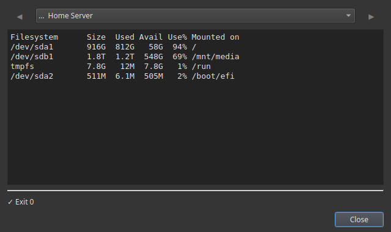

# Vedere lo spazio del NAS con un clic

Un disco pieno è ciò che rompe un server di casa senza fare rumore: i download si fermano, i backup falliscono, il server multimediale non aggiunge più file e i database si corrompono. La soluzione è controllare lo spazio *prima* che si riempia, ma chi ha voglia di entrare in SSH sul NAS e scrivere `df -h` ogni settimana?

Commandeck lo trasforma in un pulsante. Un clic e vedi esattamente quanto è pieno ogni disco, in una finestra sulla tua scrivania.

---

## Il pulsante

Clic destro sulla griglia → **Nuovo pulsante** e compila:

| Campo | Valore |
|-------|--------|
| Etichetta | `Spazio su disco` |
| Comando | `df -h` |
| Modalità di esecuzione | `Mostra l'output` |
| Icona | `drive-harddisk-symbolic` |
| Suggerimento | `Quanto è pieno ogni disco` |

Premendolo ottieni una tabella chiara: ogni disco, la sua dimensione, quanto è occupato e la percentuale di riempimento. La colonna che conta è **Use%**: qualsiasi valore vicino al 90% merita attenzione.

---

## Altri pulsanti utili per i dischi

| Etichetta | Comando | Cosa mostra |
|-----------|---------|-------------|
| `Cartelle più grandi` | `du -h -d 1 / \| sort -hr \| head -20` | Che cosa sta mangiando lo spazio |
| `Cartelle più grandi (home)` | `du -h -d 1 ~ \| sort -hr \| head -20` | Lo stesso, dentro la tua cartella personale |
| `Spazio usato da Docker` | `docker system df` | Quanto sta occupando Docker |
| `Liberare spazio Docker` | `docker system prune -f` | Recupera immagini e livelli inutilizzati |

Il pulsante **Cartelle più grandi** è il seguito naturale: quando `Spazio su disco` segnala un disco quasi pieno, questo ti dice *che cosa* conviene pulire.

---

## Controllare il NAS o il server (non solo questo PC)

Il tuo NAS è un'altra macchina, quindi il vero vantaggio è eseguire questi pulsanti **sul NAS via SSH** mentre sei seduto al tuo computer Windows o Mac. Aggiungi il NAS una volta, punta i pulsanti su di lui e «controllare il disco del NAS» diventa un clic dall'altra parte della casa.

!!! tip "I controlli da remoto sono Pro"
    Raggiungere un'altra macchina via SSH è [Commandeck Pro](../pro.md): **29 $ una volta sola, per sempre, con 14 giorni di prova gratuita e senza carta**. Controllare il disco di *questo* computer funziona nella versione gratuita.

---

## Fanne un'abitudine

Allo spazio su disco si pensa di solito quando è già tardi. Con un pulsante nella griglia, dargli un'occhiata costa due secondi: così lo fai davvero e ti accorgi del disco che si riempie prima che metta giù il server.

- **Niente terminale e niente `df -h` da ricordare**: è un pulsante.
- **Sola lettura e sicuro**: questi pulsanti si limitano a *guardare*, non cambiano nulla.
- **Privato**: nessun account, nessun cloud, nessuna telemetria.

---

**Correlato:** la guida [Gestione di un server domestico](../use-cases/home-server.md) prepara insieme i pulsanti di disco, aggiornamento e riavvio. Sei appena arrivato? Vedi la [Guida per principianti](../use-cases/beginner.md).
