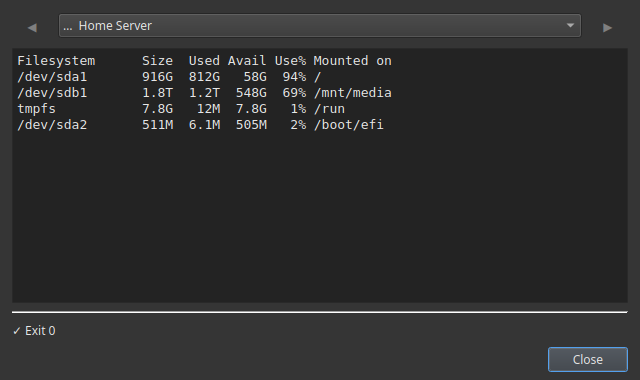

# Check Disk Space on Your NAS in One Click

A full disk is what quietly breaks a home server: downloads stop, backups fail, your media server won't add new files, databases get corrupted. The fix is to check disk space *before* it fills up — but who wants to SSH into the NAS and type `df -h` every week?

Commandeck makes it a button. One click, and you see exactly how full each drive is, in a window on your desktop.

---

## The button

Right-click the grid → **New Button** and fill in:

| Field | Value |
|-------|-------|
| Label | `Disk Space` |
| Command | `df -h` |
| Execution mode | `Show output` |
| Icon | `drive-harddisk-symbolic` |
| Tooltip | `How full is each drive` |

Click it and you get a clear table: each drive, its size, how much is used, and the percentage full. The numbers you care about are the **Use%** column — anything near 90% needs attention.

---

## More disk buttons worth having

| Label | Command | Shows you |
|-------|---------|-----------|
| `Biggest folders` | `du -h -d 1 / \| sort -hr \| head -20` | What's eating the space |
| `Biggest folders (home)` | `du -h -d 1 ~ \| sort -hr \| head -20` | Same, inside your home folder |
| `Docker disk use` | `docker system df` | How much Docker is using |
| `Free up Docker space` | `docker system prune -f` | Reclaims unused images/layers |

The **Biggest folders** button is the natural follow-up: when `Disk Space` shows a drive is nearly full, this one tells you *what* to clean up.

---

## Checking a NAS or server (not just this PC)

Your NAS is a separate machine, so the real win is running these buttons **on the NAS over SSH** while you sit at your Windows or Mac desktop. Add the NAS once, point the buttons at it, and "check the NAS disk" becomes a single click from across the house.

!!! tip "Remote checks are Pro"
    Reaching another machine over SSH is [Commandeck Pro](../pro.md) — **$29 one-time, lifetime, 14-day free trial (no card)**. Checking *this* computer's disk works free.

---

## Make it a habit

Disk space is the kind of thing you only think about once it's too late. With a button sitting in your grid, glancing at it takes two seconds — so you actually do it, and you catch a filling drive before it takes the server down.

- **No terminal, no remembering `df -h`** — it's a button.
- **Read-only and safe** — these buttons only *look*; they change nothing.
- **Private** — no account, no cloud, no telemetry.

---

**Related:** the [Home Server Management](../use-cases/home-server.md) guide sets up disk, update and restart buttons together. New here? See the [Beginner Guide](../use-cases/beginner.md).
