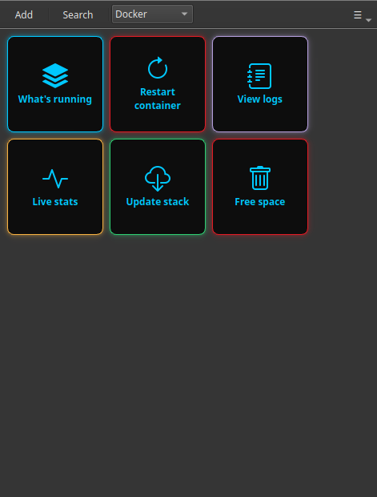

# Comandi Docker come pulsanti

Se il tuo server di casa fa girare applicazioni in Docker — Jellyfin, Immich, Pi-hole, Nextcloud, la suite *arr — convivi con una manciata di comandi `docker` che riscrivi in continuazione: vedere che cosa è attivo, riavviare un container, guardare i log, aggiornare lo stack. Non sono difficili, ma è facile sbagliarli ed è noioso digitarli ogni volta.

Commandeck trasforma ciascuno in un pulsante. Lo premi, il comando parte (su questo computer o sul tuo server via SSH) e l'output compare in una finestra.

---

## I comandi Docker che vale la pena trasformare in pulsanti

| Compito | Comando | Modalità consigliata |
|---------|---------|----------------------|
| Vedere cosa è attivo | `docker ps` | Mostra l'output |
| Vedere tutto (anche fermo) | `docker ps -a` | Mostra l'output |
| Riavviare un container | `docker restart jellyfin` | Silenzioso + conferma |
| Vedere i log di un container | `docker logs --tail 100 jellyfin` | Mostra l'output |
| Consumo di risorse in tempo reale | `docker stats --no-stream` | Mostra l'output |
| Aggiornare uno stack compose | `docker compose pull && docker compose up -d` | Mostra l'output + conferma |
| Liberare spazio su disco | `docker system prune -f` | Mostra l'output + conferma |
| Spazio occupato da Docker | `docker system df` | Mostra l'output |

Il pulsante «aggiorna lo stack» è quello che piace di più: scarica le immagini più recenti e riavvia tutto, con un clic invece di due comandi scritti nell'ordine giusto.

---

## Crea una categoria «Docker»

Crea i pulsanti qui sopra e scrivi `Docker` nel campo **Categoria** di ognuno. Si raggrupperanno sotto un'unica voce del menu delle categorie, così tutti i comandi dei container stanno in un solo posto ordinato.

Negli esempi sostituisci `jellyfin` con il nome del tuo container (`docker ps` mostra i nomi).

!!! tip "Un solo pulsante per qualsiasi container"
    Con una [variabile di comando](../reference/command-variables.md), un unico pulsante **Riavvia container** può chiedere *quale* ogni volta: scrivi o scegli il nome ed esegue `docker restart {{container}}`. Un pulsante li copre tutti.

---

## Eseguili sul server, non solo in locale

Docker di solito gira sul server — il NAS o il mini-PC — non sul portatile. Punta i pulsanti su quella macchina e verranno eseguiti via SSH, così gestisci i container dalla scrivania a cui sei seduto.

!!! tip "Da remoto = Pro"
    Eseguire pulsanti su un'altra macchina via SSH è [Commandeck Pro](../pro.md): **29 $ una volta sola, per sempre, con 14 giorni di prova gratuita e senza carta**. I pulsanti che usano Docker su *questo* computer funzionano nella versione gratuita.

---

## Perché i pulsanti battono la riscrittura

- **Il comando giusto, nell'ordine giusto, ogni volta** — soprattutto «aggiorna lo stack», che sono due passaggi.
- **Nessun nome di container o parametro da ricordare**: stanno dentro il pulsante.
- **Una conferma** su quelli distruttivi (`prune`, riavvii) perché nulla accada per sbaglio.
- **Privato**: nessun account, nessun cloud, nessuna telemetria; il comando va dritto alla tua macchina.

Costruisci la categoria una volta e tutto il tuo Docker diventa un pannello di pulsanti che chiunque in casa potrebbe usare.

---

**Correlato:** vedi la guida [Gestione di un server domestico](../use-cases/home-server.md) per la configurazione completa, oppure quella sul [Flusso di sviluppo](../use-cases/dev-workflow.md) se sono container di sviluppo.
