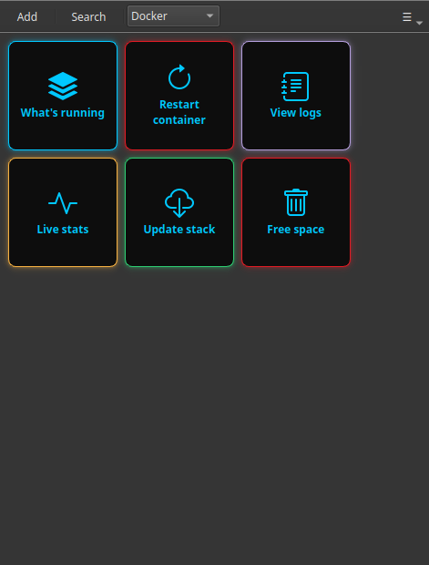

# Run Docker Commands as One-Click Buttons

If your home server runs apps in Docker — Jellyfin, Immich, Pi-hole, Nextcloud, the *arr stack — you live with a handful of `docker` commands you keep retyping: list what's running, restart a container, check logs, update the stack. They're not hard, but they're easy to fumble and annoying to type over and over.

Commandeck turns each of those into a button. Click it, the command runs (on this computer or on your server over SSH), and the output appears in a window.

---

## The Docker commands worth turning into buttons

| Task | Command | Suggested mode |
|------|---------|----------------|
| See what's running | `docker ps` | Show output |
| See everything (incl. stopped) | `docker ps -a` | Show output |
| Restart a container | `docker restart jellyfin` | Silent + Confirm |
| View a container's logs | `docker logs --tail 100 jellyfin` | Show output |
| Live resource usage | `docker stats --no-stream` | Show output |
| Update a compose stack | `docker compose pull && docker compose up -d` | Show output + Confirm |
| Free up disk space | `docker system prune -f` | Show output + Confirm |
| Disk used by Docker | `docker system df` | Show output |

The "update the stack" button is the one people love most — it pulls the newest images and restarts everything, in one click instead of two commands typed in the right order.

---

## Make a "Docker" category

Create the buttons above and set each one's **Category** to `Docker`. They'll group together under a single entry in the category dropdown, so all your container controls sit in one tidy place.

For the example commands, replace `jellyfin` with your own container name (`docker ps` shows you the names).

!!! tip "One button for any container"
    With a [command variable](../reference/command-variables.md), a single **Restart container** button can ask *which* container each time — type or pick the name, and it runs `docker restart {{container}}`. One button covers them all.

---

## Run them on your server, not just locally

Docker usually runs on your server — the NAS or mini-PC — not on your laptop. Point the buttons at that machine and they run over SSH, so you manage your containers from the desktop you sit at.

!!! tip "Remote = Pro"
    Running buttons on another machine over SSH is [Commandeck Pro](../pro.md) — **$29 one-time, lifetime, 14-day free trial (no card)**. Buttons that run Docker on *this* computer work on the free version.

---

## Why buttons beat retyping

- **The right command, in the right order, every time** — especially the two-step "update the stack".
- **No memorising container names or flags** — they're baked into the button.
- **A confirmation prompt** on the destructive ones (`prune`, restarts) so nothing happens by accident.
- **Private** — no account, no cloud, no telemetry; the command goes straight to your machine.

Build the category once, and your whole Docker setup becomes a panel of buttons anyone in the house could use.

---

**Related:** see the [Home Server Management](../use-cases/home-server.md) guide for the full setup, or the [Development Workflow](../use-cases/dev-workflow.md) guide if these are dev containers.
