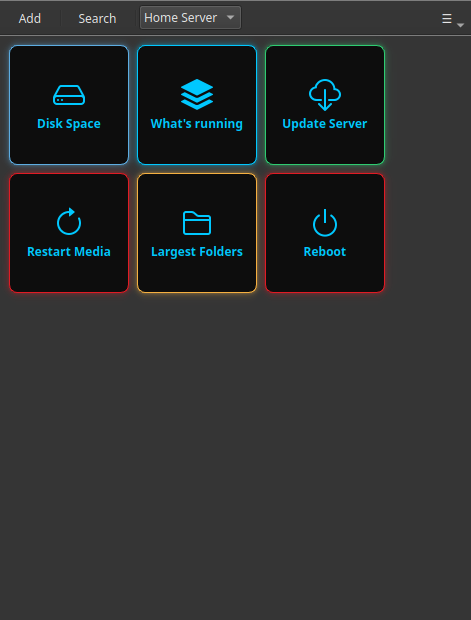

# Gestire il server di casa da Windows

Tu lavori su un PC Windows, ma il tuo server di casa gira su Linux: un NAS, un mini-PC, una macchina con Proxmox, un Raspberry Pi. Ogni volta che chiede attenzione ti tocca scegliere tra opzioni scomode: aprire PowerShell ed entrare in SSH a mano, installare PuTTY e ricordare i comandi, oppure frugare in un pannello web che non copre quello che ti serve davvero.

Commandeck ti dà una terza possibilità: una normale applicazione Windows in cui ogni compito del server è un pulsante. Lo premi, il comando gira sul tuo server Linux via SSH e l'output compare in una finestra. Niente terminale e nessun comando da ricordare.

---

## Perché funziona nella situazione Windows-verso-Linux

Oggi molti server di casa nascono con un assistente IA come insegnante: ti dice cosa installare e ti passa i comandi. Ti ritrovi con una macchina Linux che tocchi di rado e una montagna di comandi sparsi in vecchie conversazioni con ChatGPT o Claude. Ritrovarli ogni volta che qualcosa si rompe è la vera seccatura.

Commandeck è il posto dove quei comandi diventano pulsanti. Funziona in modo nativo su Windows (e anche su Mac e Linux), così gestisci il server Linux dalla scrivania che usi già tutto il giorno.

---

## Passo 1 — Installa Commandeck su Windows

[Scarica](../download.md) l'installer per Windows e avvialo. È una normale applicazione desktop: non serve la riga di comando né per installarla né per usarla.

---

## Passo 2 — Aggiungi il server una volta sola

Apri **Menu → Gestisci macchine → +** e inserisci i dati del tuo server:

| Campo | Esempio |
|-------|---------|
| Nome | `Server di casa` |
| Host | `192.168.1.50` |
| Utente SSH | `pi` |
| Porta | `22` |
| Chiave SSH | premi **Genera chiave SSH**, poi **Copia la chiave sul server** |

Se non hai mai usato le chiavi SSH, Commandeck le prepara per te: genera una chiave, la copia sul server (scrivi la password una volta) e poi premi **Prova** per confermare che si collega. Da lì in poi non digiti più nessuna password.

!!! tip "L'SSH è Pro"
    Collegarsi a un'altra macchina è una funzione di [Commandeck Pro](../pro.md): **29 $ una volta sola, tuo per sempre, con 14 giorni di prova gratuita e senza carta**. È il motivo principale per cui questa app esiste nel caso Windows-verso-Linux.

---

## Passo 3 — Trasforma in pulsanti le cose che fai spesso

Fai un pulsante per ogni cosa che fai regolarmente sul server. Alcune valgono per quasi tutti i server di casa:

| Etichetta | Comando | Modalità |
|-----------|---------|----------|
| `Spazio su disco` | `df -h` | Mostra l'output |
| `Cosa è attivo` | `docker ps` | Mostra l'output |
| `Aggiorna il server` | `sudo apt update && sudo apt upgrade -y` | Mostra l'output |
| `Riavvia il multimediale` | `sudo systemctl restart jellyfin` | Silenzioso + conferma |
| `Riavvia` | `sudo systemctl reboot` | Silenzioso + conferma (rosso) |

Ogni pulsante punta al server aggiunto nel passo 2. Premendolo, il comando viene eseguito **sul server** e il risultato appare sulla tua scrivania Windows.

---

## Il risultato

Il tuo server Linux di casa ora ha un pannello di controllo su Windows costruito da te, tagliato esattamente sui compiti che svolgi. Niente PowerShell, niente PuTTY, nessuna caccia nelle vecchie conversazioni.

- **Privato per costruzione**: nessun account, nessun cloud, nessuna telemetria. I comandi vanno dritti dal tuo PC al tuo server.
- **I tuoi pulsanti sono file normali** sul tuo computer: falli copiare, portali su un altro PC, sono tuoi.
- **La stessa app su Mac e Linux** se cambi macchina, e un'app Android nativa perché gli stessi pulsanti funzionino dal telefono.

---

**Correlato:** la guida [Gestione di un server domestico](../use-cases/home-server.md) è la versione completa, passo per passo, di questa pagina. Hai più macchine? Vedi [Gestire un parco homelab](../use-cases/homelab.md).
