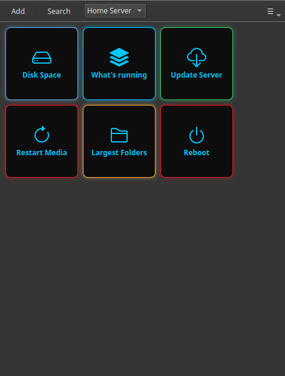

# Manage Your Home Server From Windows

You live on a Windows PC, but your home server runs Linux — a NAS, a mini-PC, a Proxmox box, a Raspberry Pi. Every time it needs attention you're stuck choosing between clunky options: open PowerShell and SSH in by hand, install PuTTY and remember the commands, or dig through the web dashboard that doesn't cover what you actually need.

Commandeck gives you a third option: a normal Windows app where each server task is a button. Click it, the command runs on your Linux server over SSH, and the output shows up in a window. No terminal, no remembering commands.

---

## Why this fits the Windows-to-Linux situation

A lot of home servers today are set up with an AI assistant as the tutor — it tells you what to install and hands you the commands. You end up with a Linux box you barely touch directly and a pile of commands scattered across old ChatGPT or Claude chats. Re-finding them every time something breaks is the real chore.

Commandeck is where those commands become buttons. It runs natively on Windows (also Mac and Linux), so you manage the Linux server from the desktop you already use all day.

---

## Step 1 — Install Commandeck on Windows

[Download](../download.md) the Windows installer and run it. It's a normal desktop app — no command line needed to install or use it.

---

## Step 2 — Add your server once

Open **Menu → Manage Machines → +** and fill in your server's details:

| Field | Example |
|-------|---------|
| Name | `Home Server` |
| Host | `192.168.1.50` |
| SSH User | `pi` |
| Port | `22` |
| SSH Key | click **Generate SSH key**, then **Copy key to server** |

If you've never used SSH keys before, Commandeck sets them up for you — generate a key, copy it to the server (you type your password once), then click **Test** to confirm it connects. After that you never type a password again.

!!! tip "SSH is Pro"
    Connecting to another machine is a [Commandeck Pro](../pro.md) feature — **$29 one-time, yours for good, 14-day free trial (no card)**. It's the core reason this app exists for the Windows-to-Linux case.

---

## Step 3 — Turn your common tasks into buttons

Make a button for each thing you regularly do on the server. A few that fit almost every home server:

| Label | Command | Mode |
|-------|---------|------|
| `Disk Space` | `df -h` | Show output |
| `What's running` | `docker ps` | Show output |
| `Update Server` | `sudo apt update && sudo apt upgrade -y` | Show output |
| `Restart Media Server` | `sudo systemctl restart jellyfin` | Silent + Confirm |
| `Reboot` | `sudo systemctl reboot` | Silent + Confirm (red) |

Each button points at the server you added in Step 2. Clicking it runs the command **on the server** and shows you the result on your Windows desktop.

---

## The result

Your Linux home server now has a Windows control panel that you built, tuned to exactly the tasks you do. No PowerShell, no PuTTY, no hunting through old chats.

- **Private by design** — no account, no cloud, no telemetry. Commands go straight from your PC to your server.
- **Your buttons are plain files** on your own computer — back them up, move them to another PC, they're yours.
- **Same app on Mac and Linux** if you switch machines later, and a native Android app so the same buttons work from your phone.

---

**Related:** the [Home Server Management](../use-cases/home-server.md) guide is the full step-by-step version of this. Managing several boxes? See [Manage a Homelab Fleet](../use-cases/homelab.md).
