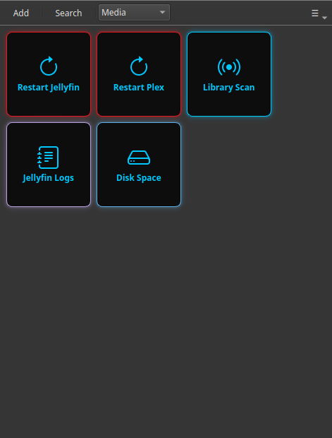

# Riavviare Jellyfin o Plex senza terminale

Il tuo server multimediale ha smesso di rispondere a metà film, oppure non rileva più i file nuovi, e il rimedio di sempre è «riavviare il servizio». Ma questo significa aprire un terminale, ricordare il comando `systemctl` esatto e scriverlo senza sbagliare. C'è un modo più veloce: trasformare quel comando in un pulsante da premere.

È esattamente ciò che fa Commandeck, un'applicazione desktop per Windows, Mac e Linux. Configuri il pulsante una volta e da lì in poi riavviare Jellyfin o Plex è un solo clic, con il risultato in una finestra.

!!! tip "Esiste già un insieme pronto per Jellyfin"
    Questa pagina crea un pulsante a mano, che è il modo giusto per imparare. Se usi Jellyfin
    e vuoi gli altri tredici — perché si blocca, che cosa riempie il disco, quale log
    leggere — installa il pacchetto:
    [Tenere in forma Jellyfin senza imparare Docker](../use-cases/jellyfin.md).

---

## Il comando dietro al pulsante

Sulla maggior parte dei server domestici il comando di riavvio è uno di questi:

| Server | Comando |
|--------|---------|
| **Jellyfin** | `sudo systemctl restart jellyfin` |
| **Plex** | `sudo systemctl restart plexmediaserver` |
| **Jellyfin (Docker)** | `docker restart jellyfin` |
| **Plex (Docker)** | `docker restart plex` |

Se hai messo su il server con l'aiuto di un assistente IA, questo è il comando che ti ha dato. Commandeck è il posto dove quel comando smette di vivere in una vecchia conversazione e diventa un pulsante.

---

## Creare il pulsante

Clic destro sulla griglia → **Nuovo pulsante** (oppure premi `Ctrl+N`) e compila:

| Campo | Valore |
|-------|--------|
| Etichetta | `Riavvia Jellyfin` |
| Comando | `sudo systemctl restart jellyfin` |
| Modalità di esecuzione | `Silenzioso` |
| Chiedi conferma prima di eseguire | **Attivo** |
| Colore | `#e01b24` (rosso: segnala «questo riavvia qualcosa») |
| Suggerimento | `Riavvia il server multimediale Jellyfin` |

**Chiedi conferma prima di eseguire** è la rete di sicurezza: mostra un «sei sicuro?» così non riavvii mai il server per sbaglio mentre qualcuno sta guardando qualcosa.

Per un server che gira **su questo stesso computer** è tutto qui. Premi il pulsante, confermi, fatto.

---

## Eseguirlo su un'altra macchina (il tuo NAS o mini-PC)

Quasi tutti tengono Jellyfin o Plex su una macchina a parte — un NAS, un Raspberry Pi, un mini-PC — e non sul portatile di tutti i giorni. Commandeck può raggiungere quella macchina via SSH ed eseguire lì il pulsante, così riavvii il tuo server multimediale **dalla scrivania a cui sei davvero seduto**.

Aggiungi il server una volta (indirizzo e nome utente) e punti il pulsante su di lui. Da quel momento è lo stesso clic singolo.

!!! tip "Questa parte è Pro"
    Controllare un'altra macchina via SSH è una funzione di [Commandeck Pro](../pro.md): **29 $ una volta sola, tuo per sempre, con 14 giorni di prova gratuita e senza carta**. La versione gratuita esegue i pulsanti sul tuo computer. Vedi [Macchine SSH](../reference/ssh-machines.md) per configurarlo.

---

## Perché è meglio che aprire un terminale

- **Niente da ricordare.** Il comando esatto vive nel pulsante, non nella tua testa né in una vecchia chat con un'IA.
- **Nessun errore di battitura su un comando delicato.** Fai clic; non riscrivi `systemctl` alle undici di sera.
- **Una richiesta di conferma** evita i riavvii accidentali.
- **Privato per costruzione.** Commandeck non ha account, né cloud, né telemetria. Il comando va direttamente dal tuo computer al tuo server e da nessun'altra parte.

Una volta creato il pulsante, la prossima volta che Jellyfin fa i capricci risolvi con un clic: senza terminale e senza cercare nulla.

---

**Correlato:** stai preparando un server intero? La guida [Gestione di un server domestico](../use-cases/home-server.md) accompagna passo passo l'SSH e una griglia completa. Nuovo di Commandeck? Comincia dalla [Guida per principianti](../use-cases/beginner.md).
