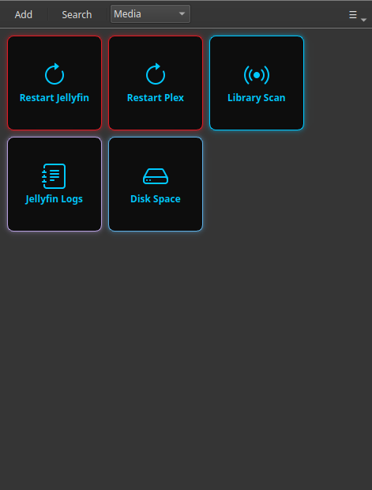

# Restart Jellyfin or Plex Without the Terminal

Your media server stopped responding mid-movie, or it stopped picking up new files, and the usual fix is "restart the service". But that means opening a terminal, remembering the exact `systemctl` command, and typing it without a mistake. There is a faster way: turn that one command into a button you click.

This is exactly what Commandeck does — a desktop app for Windows, Mac and Linux. You set the button up once; after that, restarting Jellyfin or Plex is a single click, with the result shown in a window.

---

## The command behind the button

On most home servers the restart command is one of these:

| Server | Command |
|--------|---------|
| **Jellyfin** | `sudo systemctl restart jellyfin` |
| **Plex** | `sudo systemctl restart plexmediaserver` |
| **Jellyfin (Docker)** | `docker restart jellyfin` |
| **Plex (Docker)** | `docker restart plex` |

If your AI assistant set up your server, this is the command it gave you. Commandeck is where that command stops living in an old chat and becomes a button instead.

---

## Make the button

Right-click the grid → **New Button** (or press `Ctrl+N`) and fill in:

| Field | Value |
|-------|-------|
| Label | `Restart Jellyfin` |
| Command | `sudo systemctl restart jellyfin` |
| Execution mode | `Silent` |
| Confirm before running | **Enabled** |
| Color | `#e01b24` (red — signals "this restarts something") |
| Tooltip | `Restart the Jellyfin media server` |

**Confirm before running** is the safety net: it pops up a "are you sure?" dialog so you never restart the server by accident while someone is watching.

That's it for a server you run **on this same computer**. Click the button, confirm, done.

---

## Running it on a different machine (your NAS or mini-PC)

Most people run Jellyfin/Plex on a separate box — a NAS, a Raspberry Pi, a mini-PC — not on the laptop they use every day. Commandeck can reach that machine over SSH and run the button there, so you restart your media server **from the desktop you actually sit at**.

You add the server once (its address and your login), then point the button at it. From then on it's the same single click.

!!! tip "This part is Pro"
    Controlling another machine over SSH is a [Commandeck Pro](../pro.md) feature — **$29 one-time, yours for good, with a 14-day free trial (no card)**. The free version runs buttons on your own computer. See [SSH Machines](../reference/ssh-machines.md) to set it up.

---

## Why this beats opening a terminal

- **Nothing to remember.** The exact command lives in the button, not in your head or an old AI chat.
- **No typos on a risky command.** You click; you don't retype `systemctl` at 11 pm.
- **A confirmation prompt** stops accidental restarts.
- **Private by design.** Commandeck has no account, no cloud, no telemetry. The command runs straight from your computer to your server and nowhere else.

Once the button exists, the next time Jellyfin acts up you fix it in one click — no terminal, no searching.

---

**Related:** setting up a whole server? The [Home Server Management](../use-cases/home-server.md) guide walks through SSH and a full button grid step by step. New to Commandeck? Start with the [Beginner Guide](../use-cases/beginner.md).
