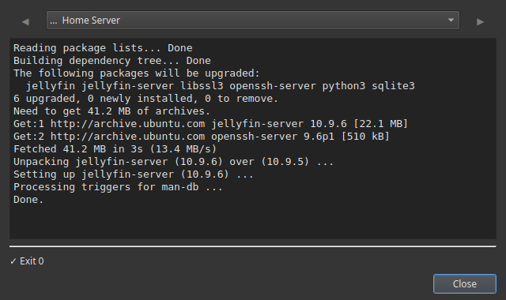

# Mettre à jour son serveur sans se connecter en SSH

Garder un serveur maison à jour, c'est la corvée que tout le monde repousse : il faut se connecter en SSH, se rappeler si c'est `apt` ou `dnf`, lancer la mise à jour, peut-être redémarrer. Alors ça traîne — et un serveur non mis à jour, c'est celui qui récolte une faille de sécurité ou casse à la prochaine grosse montée de version.

Commandeck transforme « mettre à jour le serveur » en un bouton que vous cliquez depuis votre bureau. La mise à jour s'exécute via SSH sur le serveur lui-même ; vous n'avez qu'à regarder la sortie.

---

## Le bouton de mise à jour

Choisissez la commande qui correspond au Linux de votre serveur :

| Type de serveur | Commande |
|-----------------|----------|
| **Ubuntu / Debian / Raspberry Pi OS** | `sudo apt update && sudo apt upgrade -y` |
| **Fedora / CentOS / Rocky** | `sudo dnf upgrade -y` |
| **Arch** | `sudo pacman -Syu --noconfirm` |
| **Stack Docker** | `docker compose pull && docker compose up -d` |

Créez le bouton :

| Champ | Valeur |
|-------|--------|
| Libellé | `Mettre à jour le serveur` |
| Commande | *(d'après le tableau ci-dessus)* |
| Mode d'exécution | `Afficher la sortie` |
| Confirmer avant d'exécuter | **Activé** |
| Info-bulle | `Met à jour tous les paquets du serveur` |

**Afficher la sortie** vous laisse suivre la mise à jour et voir ce qui a changé. **Confirmer avant d'exécuter** vous donne un « oui/non » avant le démarrage.

---

## Une routine de mise à jour sûre, en trois boutons

Les mises à jour se passent mieux en petite séquence. Faites un bouton pour chaque :

1. **`Espace disque`** → `df -h` — vérifiez qu'il y a de la place avant de mettre à jour.
2. **`Mettre à jour le serveur`** → la commande ci-dessus — lancez la montée de version.
3. **`Redémarrer si besoin`** → `sudo systemctl reboot` (Silencieux + Confirmer, rouge) — seulement si la mise à jour le demande.

Mettre à jour devient alors : clic, clic, fini — sans terminal, sans essayer de se rappeler les commandes exactes.

---

## Ça s'exécute sur le serveur, via SSH

Tout l'intérêt, c'est de faire ça **depuis votre bureau du quotidien** — Windows, Mac ou Linux — pendant que les commandes tournent sur le serveur. Ajoutez le serveur une fois ; le bouton l'atteint via SSH à chaque clic.

!!! tip "Le SSH est Pro"
    Exécuter des boutons sur une machine distante, c'est [Commandeck Pro](../pro.md) — **29 $ une seule fois, à vie, essai gratuit de 14 jours (sans carte)**. Mettre à jour *cet* ordinateur fonctionne dans la version gratuite.

---

## Pourquoi ça se fait enfin

- **Zéro friction = ça arrive vraiment.** Un bouton cliquable en deux secondes, c'est un serveur qui reste à jour.
- **Vous voyez la sortie** — pas de mise à jour à l'aveugle ; vous regardez ce qui a changé.
- **Une confirmation** avant que quoi que ce soit ne tourne, et un bouton de redémarrage séparé que vous contrôlez.
- **Privé** — ni compte, ni cloud, ni télémétrie. Directement de votre bureau à votre serveur.

---

**Pour aller plus loin :** le guide [Gestion d'un serveur domestique](../use-cases/home-server.md) construit toute la grille de maintenance. Pour vérifier l'espace d'abord, voir [Voir l'espace disque de son NAS](check-disk-space-nas.md).
