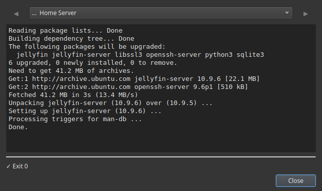

# Aggiornare il server senza SSH

Tenere aggiornato un server di casa è il lavoretto che tutti rimandano: bisogna entrare in SSH, ricordare se tocca `apt` o `dnf`, lanciare l'aggiornamento e magari riavviare. Così si rimanda, e un server non aggiornato è quello che finisce con un buco di sicurezza o si rompe al prossimo aggiornamento importante.

Commandeck trasforma «aggiorna il server» in un pulsante che premi dalla tua scrivania. L'aggiornamento gira via SSH sul server stesso; tu guardi soltanto l'output.

---

## Il pulsante di aggiornamento

Scegli il comando adatto al Linux del tuo server:

| Tipo di server | Comando |
|----------------|---------|
| **Ubuntu / Debian / Raspberry Pi OS** | `sudo apt update && sudo apt upgrade -y` |
| **Fedora / CentOS / Rocky** | `sudo dnf upgrade -y` |
| **Arch** | `sudo pacman -Syu --noconfirm` |
| **Stack Docker** | `docker compose pull && docker compose up -d` |

Crea il pulsante:

| Campo | Valore |
|-------|--------|
| Etichetta | `Aggiorna il server` |
| Comando | *(quello della tabella qui sopra)* |
| Modalità di esecuzione | `Mostra l'output` |
| Chiedi conferma prima di eseguire | **Attivo** |
| Suggerimento | `Aggiorna tutti i pacchetti del server` |

**Mostra l'output** ti permette di seguire l'aggiornamento mentre avviene e di vedere che cosa è cambiato. **Chiedi conferma** ti fa dire sì o no prima di partire.

---

## Una routine di aggiornamento sicura, in tre pulsanti

Gli aggiornamenti riescono meglio come piccola sequenza. Fai un pulsante per ogni passo:

1. **`Spazio su disco`** → `df -h`: assicurati che ci sia posto prima di aggiornare.
2. **`Aggiorna il server`** → il comando qui sopra: lancia l'aggiornamento.
3. **`Riavvia se serve`** → `sudo systemctl reboot` (silenzioso + conferma, in rosso): solo se l'aggiornamento lo chiede.

Ora aggiornare è: clic, clic, fatto. Senza terminale e senza provare a ricordare i comandi esatti.

---

## Tutto gira sul server, via SSH

Il punto è farlo **dalla scrivania di tutti i giorni** — Windows, Mac o Linux — mentre i comandi girano sul server. Aggiungi il server una volta e il pulsante lo raggiunge via SSH ogni volta.

!!! tip "L'SSH è Pro"
    Eseguire pulsanti su una macchina remota è [Commandeck Pro](../pro.md): **29 $ una volta sola, per sempre, con 14 giorni di prova gratuita e senza carta**. Aggiornare *questo* computer funziona nella versione gratuita.

---

## Perché così lo fai davvero

- **Senza attrito, succede davvero.** Un pulsante che si preme in due secondi è un server che resta aggiornato.
- **Vedi l'output**: niente aggiornamenti alla cieca, guardi che cosa è cambiato.
- **Una conferma** prima che parta qualcosa, e un pulsante di riavvio separato che controlli tu.
- **Privato**: nessun account, nessun cloud, nessuna telemetria. Dritto dalla tua scrivania al tuo server.

---

**Correlato:** la guida [Gestione di un server domestico](../use-cases/home-server.md) costruisce l'intera griglia di manutenzione. Per controllare prima lo spazio, vedi [Vedere lo spazio del NAS](check-disk-space-nas.md).
