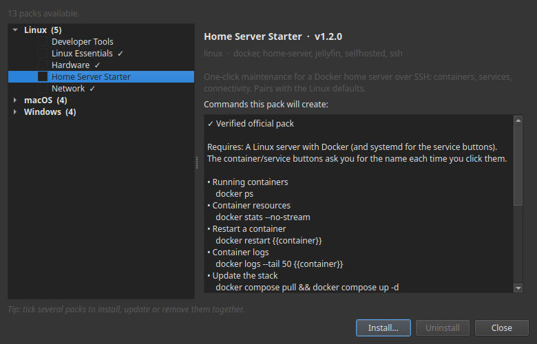

# Packs de botones

Un **pack de botones** es un conjunto ya preparado de botones para una tarea habitual: mantener un servidor en forma, liberar espacio en disco, reiniciar un servicio. Instalas uno y esas tareas se convierten en botones que pulsas, en tu ordenador o en tu móvil. Sin terminal y sin comandos que recordar.

**Todos los packs son gratuitos.** Los ves dentro de Commandeck, instalas uno con un toque y lo quitas igual de fácil.

## Qué es un pack

Un juego de herramientas escogido a mano para un tipo de instalación, hecho por gente que la usa de verdad. Lo instalas en segundos y tus tareas más habituales se convierten cada una en un botón ordenado y listo.

- **Elegido por quien lo usa**: las acciones que importan, sin ruido.
- **Gratis para todo el mundo**: instala tantos como quieras, en el escritorio (Linux, macOS, Windows) *y* en Android cuando llegue la aplicación móvil (próximamente).
- **Verificado**: los packs oficiales están firmados digitalmente; Commandeck comprueba la firma y muestra una marca ✓ antes de instalar, para que sepas que es auténtico y no ha sido manipulado.
- **Seguro por diseño**: cada botón está a la vista y se puede editar, y todo lo que cambie o detenga algo pide confirmación antes de ejecutarse.

---

## Conseguir un pack: la galería

No hay ningún archivo que buscar ni ninguna cuenta que crear. Todo ocurre dentro de la aplicación:

1. Abre Commandeck → menú **☰ → Packs de botones**.
2. Recorre la galería. Elige un pack para leer para qué sirve y ver los **comandos exactos** que ejecutará cada botón.
3. Pulsa **Instalar**. Los botones aparecen en tu cuadrícula, ya ordenados.
4. ¿Te has arrepentido? Abre el pack otra vez y pulsa **Desinstalar**: quita solo los botones de ese pack y deja el resto de tu cuadrícula intacta.
5. Cuando hay una versión más reciente de un pack que tienes, la galería lo marca con una insignia **⬆ actualizar**; pulsa **Actualizar** para refrescarlo en su sitio.

**Varios a la vez.** Marca la casilla de los packs que quieras y usa la barra de acciones para **instalarlos, actualizarlos o quitarlos juntos**. Una selección mezclada no es problema: Commandeck instala los nuevos y actualiza los que ya tenías en una sola pasada, y luego te dice qué ha cambiado.

La galería descarga los packs por internet y verifica cada uno antes de instalarlo.

## Dónde se ejecutan los packs

Instalar un pack siempre es gratis, y los botones se ejecutan **en local** — en el ordenador donde está instalado Commandeck — sin coste alguno.

El valor de verdad está en ejecutarlos en tu **servidor doméstico**. Para enviar los comandos de un pack a otra máquina por SSH necesitarás **Pro**, y toda instalación incluye una **prueba gratuita de 14 días, sin tarjeta**. Pro son 29 $ una sola vez — se compra una vez y es tuyo para siempre — y es lo que mantiene vivo a Commandeck; los packs siguen siendo gratuitos, para siempre.

---

## Packs disponibles

### 🧰 Herramientas de desarrollo

Git, Python y Node de un vistazo, para quien programa en la máquina y no solo la usa como servidor. Estado, historial y diferencias de Git, tu versión de Python, los paquetes pip desactualizados, tu versión de Node y más.

### 🏠 Servidor doméstico para empezar

Mantenimiento en un clic para un servidor doméstico con Docker por SSH: ver los contenedores en marcha y lo que consumen, reiniciar un contenedor o un servicio, seguir los registros, actualizar todo el conjunto, limpiar el disco de Docker y comprobar tu IP pública y la conectividad. Va bien junto a los botones por defecto de Linux: apúntalo a tu servidor con la prueba gratuita.

*Vienen más*: administración de servidores de juego, equipos de IA local, homelab y NAS, y lo que la comunidad pida a continuación.

---

## Packs que crecen contigo y con tu comunidad

Un pack no es un archivo congelado. Es un juego de herramientas vivo:

- **Actualizaciones gratuitas.** Cuando un pack gana acciones nuevas o más afinadas, reinstálalo para actualizarlo en su sitio: la máquina que le asignaste y tus retoques personales se quedan tal cual, y Commandeck **pregunta** antes de tocar nada que hayas personalizado.
- **Moldeados por la comunidad.** Estos packs salen de los mismos foros y Discords en los que ya andas. ¿Echas de menos una acción? Propónla: las mejores ideas llegan a todo el mundo en la siguiente actualización.

---

## Preguntas frecuentes

**¿Hay que saber de esto?**
No. Un pack es una pantalla de botones: pulsas uno y lees el resultado. Todo lo que pueda cambiar algo pide confirmación primero, y siempre puedes ver exactamente qué hace un botón.

**¿Cómo se instala un pack?**
Abre **☰ → Packs de botones**, elige uno y pulsa **Instalar**. Para quitarlo, abre el mismo pack y pulsa **Desinstalar**. ¿Quieres varios? Marca sus casillas e instálalos, actualízalos o quítalos todos a la vez desde la barra de acciones.

**¿Cuestan algo los packs?**
No, todos son gratuitos. Instalar un pack y ejecutar sus botones en local es gratis. Ejecutarlos en otra máquina por SSH usa Pro (que viene con 14 días de prueba gratis).

**¿Funcionará en mi móvil *y* en mi ordenador?**
Hoy en tu ordenador: Linux, macOS y Windows. La aplicación de Android llegará pronto e incluirá la misma galería, así que también instalarás tus packs en el móvil.

**¿Las actualizaciones son de verdad gratis?**
Sí. Reinstala el pack y Commandeck lo actualiza en su sitio: conserva la máquina que le asignaste, refresca los botones que no has tocado y **pregunta** antes de cambiar nada que hayas personalizado.

**¿Puedo modificar los botones?**
Por supuesto: renómbralos, cámbiales el color, ajústalos. En la siguiente actualización se respetan tus cambios; Commandeck nunca sobrescribe tu trabajo sin preguntar.

**Mi instalación es un poco distinta, ¿encajará igual?**
La mayoría de las acciones funcionan tal cual. Alguna puede esperar una herramienta o una carpeta habituales en ese tipo de instalación (la página de cada pack te dice qué da por hecho). Y si te falta algo que necesitas, dilo: así es exactamente como crecen los packs.

**¿Hace falta una cuenta?**
Ninguna cuenta, ningún registro, ningún dato personal.

**¿Es seguro ejecutarlos?**
Los packs oficiales están firmados y se verifican antes de instalarse. El control siempre es tuyo: cada botón está a la vista y se puede editar, y todo lo que cambie o detenga algo pide confirmación antes de ejecutarse.

**¿Puedo proponer un pack entero?**
Adelante. Los próximos packs salen directamente de lo que la gente pide: tu comunidad puede ser la siguiente para la que construyamos uno.
