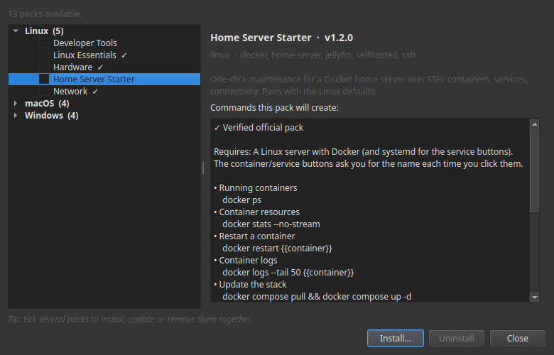

# Packs de boutons

Un **pack de boutons**, c'est un ensemble de boutons prêts à l'emploi pour une tâche
courante — garder un serveur en bonne santé, libérer de l'espace disque, redémarrer un
service. Vous en installez un, et ces tâches deviennent des boutons sur lesquels appuyer,
depuis votre ordinateur ou votre téléphone. Pas de terminal, aucune commande à retenir.

**Tous les packs sont gratuits.** Vous les parcourez directement dans Commandeck, vous en
installez un d'un appui, et vous le retirez tout aussi facilement.

## Qu'est-ce qu'un pack

Une boîte à outils triée sur le volet pour un type de configuration, créée par des gens qui
l'utilisent vraiment. Installez-la en quelques secondes, et vos tâches les plus fréquentes
deviennent chacune un bouton bien rangé, prêt à l'emploi.

- **Curé par des praticiens** — les actions qui comptent, rien d'inutile.
- **Gratuit pour tout le monde** — installez-en autant que vous voulez, sur ordinateur (Linux,
  macOS, Windows) *et* Android.
- **Vérifié** — les packs officiels sont signés numériquement ; Commandeck vérifie la signature
  et affiche un badge ✓ avant l'installation, pour que vous sachiez qu'il est authentique et
  non altéré.
- **Sûr par conception** — chaque bouton est visible et modifiable, et tout ce qui modifie ou
  arrête quelque chose demande confirmation avant de s'exécuter.

---

## Obtenir un pack : la galerie

Aucun fichier à chercher, aucun compte à créer. Tout se passe dans l'application :

1. Ouvrez Commandeck → menu **☰ → Button Packs**.
2. Parcourez la galerie. Choisissez un pack pour lire à quoi il sert et voir les **commandes
   exactes** que chaque bouton exécutera.
3. Appuyez sur **Installer**. Les boutons apparaissent dans votre grille, déjà rangés.
4. Vous changez d'avis ? Rouvrez le pack et appuyez sur **Désinstaller** — seuls les boutons de
   ce pack sont retirés, le reste de votre grille reste intact.
5. Quand une nouvelle version d'un pack que vous avez est disponible, la galerie l'indique avec
   un badge **⬆ mise à jour** ; appuyez sur **Mettre à jour** pour la rafraîchir sur place.

**Plusieurs d'un coup.** Cochez la case des packs voulus et utilisez la barre d'action pour les
**installer, mettre à jour ou supprimer ensemble**. Un mélange est permis — Commandeck installe
les nouveaux et met à jour ceux que vous avez déjà en une seule passe, puis vous résume ce qui a
changé.

La galerie récupère les packs sur Internet et vérifie chacun d'eux avant l'installation.

## Où s'exécutent les packs

Installer un pack est toujours gratuit, et les boutons s'exécutent **en local** — sur
l'ordinateur où Commandeck est installé — sans frais.

Le vrai intérêt, c'est de les exécuter sur votre **serveur maison**. Pour envoyer les commandes
d'un pack vers une autre machine via SSH, vous utiliserez **Pro** — et chaque installation
inclut un **essai gratuit de 14 jours, sans carte**. Pro, c'est 29 $ une seule fois — c'est à
vous pour toujours — qui fait vivre Commandeck ; les packs, eux, restent gratuits, pour toujours.

---

## Packs disponibles

### 🧰 Developer Tools

L'état de Git, Python et Node d'un coup d'œil — pour celles et ceux qui codent sur la machine,
pas seulement qui font tourner un serveur. Statut, journal et diff Git, votre version de
Python, les paquets pip à mettre à jour, votre version de Node, et plus encore.

### 🏠 Home Server Starter

Maintenance en un clic pour un serveur maison Docker via SSH : voir vos conteneurs en marche et
ce qu'ils consomment, redémarrer un conteneur ou un service, suivre les journaux, mettre à jour
toute la pile, faire le ménage du disque Docker, et vérifier votre IP publique et votre
connectivité. S'accorde avec les boutons par défaut Linux — pointez-le vers votre serveur avec
l'essai gratuit.

*D'autres arrivent* — administration de serveur de jeu, machines d'IA locale, homelab/NAS, et
ce que la communauté demandera ensuite.

---

## Des packs qui évoluent avec vous — et avec votre communauté

Un pack n'est pas un fichier figé. C'est une boîte à outils vivante :

- **Mises à jour gratuites.** Quand un pack gagne de nouvelles actions, ou de meilleures,
  réinstallez-le pour le mettre à jour sur place — la machine assignée comme vos réglages
  personnels restent exactement où vous les avez laissés, et Commandeck **demande** avant de
  modifier ce que vous avez personnalisé.
- **Façonnés par la communauté.** Ces packs viennent des mêmes forums, Discord et subreddits
  que vous fréquentez déjà. Vous aimeriez une action qui n'existe pas ? Proposez-la — les
  meilleures idées sont livrées à tout le monde à la mise à jour suivante.

---

## Questions fréquentes

**Faut-il être technique ?**
Non. Un pack, c'est un écran de boutons — vous appuyez, vous lisez le résultat. Tout ce qui
pourrait modifier quelque chose demande confirmation d'abord, et vous voyez toujours exactement
ce que fait un bouton.

**Comment j'installe un pack ?**
Ouvrez **☰ → Button Packs**, choisissez-en un, et appuyez sur **Installer**. Pour le retirer,
rouvrez le même pack et appuyez sur **Désinstaller**. Vous en voulez plusieurs ? Cochez leurs
cases et installez, mettez à jour ou supprimez-les tous d'un coup depuis la barre d'action.

**Les packs coûtent quelque chose ?**
Non — tous les packs sont gratuits. Installer un pack et exécuter ses boutons en local est
gratuit. Les exécuter sur une autre machine via SSH utilise Pro (livré avec un essai gratuit de
14 jours).

**Ça marchera sur mon téléphone *et* mon ordinateur ?**
Oui — Linux, macOS, Windows et Android. Ouvrez la galerie et installez sur chaque appareil.

**Les mises à jour sont vraiment gratuites ?**
Oui. Réinstallez le pack et Commandeck le met à jour sur place : il garde la machine que vous
avez assignée, rafraîchit les boutons que vous n'avez pas touchés, et **demande** avant de
modifier ce que vous avez personnalisé.

**Je peux personnaliser les boutons ?**
Tout à fait — renommez-les, recolorez-les, ajustez-les. À la mise à jour suivante, vos
changements sont respectés ; Commandeck n'écrase jamais votre travail sans demander.

**Ma configuration est un peu différente — ça ira quand même ?**
La plupart des actions fonctionnent telles quelles. Quelques-unes peuvent supposer un outil ou
un dossier courant pour ce type de configuration (la page de chaque pack indique ce qu'il
suppose). Et s'il vous manque quelque chose, dites-le-nous — c'est précisément comme ça que les
packs grandissent.

**Faut-il un compte ?**
Aucun compte, aucune inscription, aucune donnée personnelle.

**Est-ce sûr à exécuter ?**
Les packs officiels sont signés et vérifiés avant l'installation. Vous gardez toujours le
contrôle : chaque bouton est visible et modifiable, et tout ce qui modifie ou arrête quelque
chose demande confirmation avant de s'exécuter.

**Je peux suggérer un pack entièrement nouveau ?**
Avec plaisir. Les prochains packs viennent directement de ce que les gens demandent — votre
communauté est peut-être celle pour qui nous construirons la prochaine fois.
