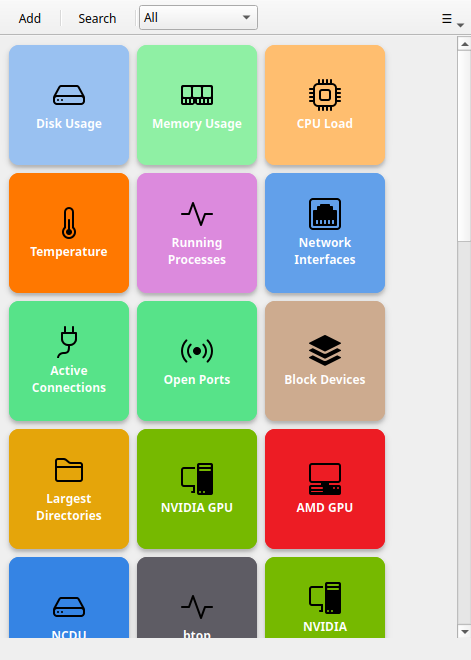

# Commandeck Pro

Commandeck comes in two builds: **Free** (open source, local execution only) and **Pro** (proprietary, full feature set with SSH and AI integration).

## Free vs Pro

| | Free | Pro |
|--|------|-----|
| Local command execution | Unlimited | Unlimited |
| Custom buttons | Unlimited | Unlimited |
| Default buttons | Visible, executable, deletable | Editable |
| SSH machines | — | Unlimited |
| Multi-machine buttons | — | ✓ |
| Multi-select + group actions | — | ✓ |
| Button themes (Bold, Phone, Neon, Retro…) | — | ✓ |
| Custom CSS theme | — | ✓ |
| Execution profiles | — | ✓ |
| Config backup / restore | — | ✓ |
| MCP server (AI integration) | — | ✓ |
| AI button execution | — | ✓ |

!!! note
    Free and Pro are **separate downloads**, not the same binary with a license unlock. The Free build does not contain any Pro code.

## Pricing

**$29 — one-time purchase.** Includes 1 year of updates. No subscription, no automatic renewals — if the project stops, your app keeps working.

[Get a license →](https://neurocontrarian.lemonsqueezy.com/checkout/buy/9c16845a-8ab6-4a36-b8da-9874d9d64f33){ .md-button .md-button--primary }

## 14-day free trial

The Pro build includes an automatic **14-day trial** that starts the first time you launch it. No license key, no payment, no email capture — every Pro feature is available immediately.

A few days before the trial ends, Commandeck shows an in-app offer with a discount code. After day 14, Pro features become read-only (greyed out) — your buttons, machines and settings are **never deleted**.

To continue using Pro, activate a license from **Preferences → License**.

## Activating your license

1. Open **Preferences** (`Ctrl+,`)
2. Scroll to the **License** section
3. Enter the email address used for purchase
4. Paste your license key
5. Click **Activate Pro**

An internet connection is required only for the initial activation. After that, Commandeck works fully offline — no connection is needed for everyday use. When you happen to be online, it occasionally re-checks the license in the background; when you're offline, it simply stays active.

## Deactivating

To remove the license from a device: **Preferences → License → Deactivate license**.

This frees up an activation slot so you can use the same key on a different device. Your Pro license allows up to **3 simultaneous activations on desktop devices** (Linux, macOS, Windows) that you personally use — see [License & Devices](pro/license-devices.md) for details.

!!! note "Android is a separate product"
    The desktop license covers **desktop only** (Linux, macOS, Windows). The Android app is a separate product available on Google Play with its own billing — it is not covered by the desktop license key.

Free-tier limits apply immediately after deactivation. Your buttons are not deleted; Pro features are restored when you reactivate.

## Execution profiles *(Pro)*

Create reusable execution contexts that combine a target user, a working directory, and a sudo password into a single named profile.

Assign a profile to any button — when it runs, the command executes as the specified user in the specified directory, with the sudo password fed automatically (no terminal prompt).

Profiles work for both local and remote (SSH) execution, including **Open in terminal** mode.

Manage profiles from the hamburger menu → **Manage Profiles**.

---

## Backup and restore *(Pro)*

Export and import your full configuration from **Preferences**:

- **Buttons backup** — exports your buttons to a `.cdbackup` file (buttons only)
- **Machines backup** — exports SSH machine definitions to a `.cdmachines` file (SSH private keys are never included)

Restore from the same Preferences section. Importing buttons merges with existing default buttons — newly added defaults are never lost.

---

## AI integration *(Pro)*

The MCP server lets AI assistants like Claude, Cursor or Open WebUI read, edit and execute your buttons through a single secure connection. See [AI Integration (MCP)](pro/mcp.md) for full setup and security details.
