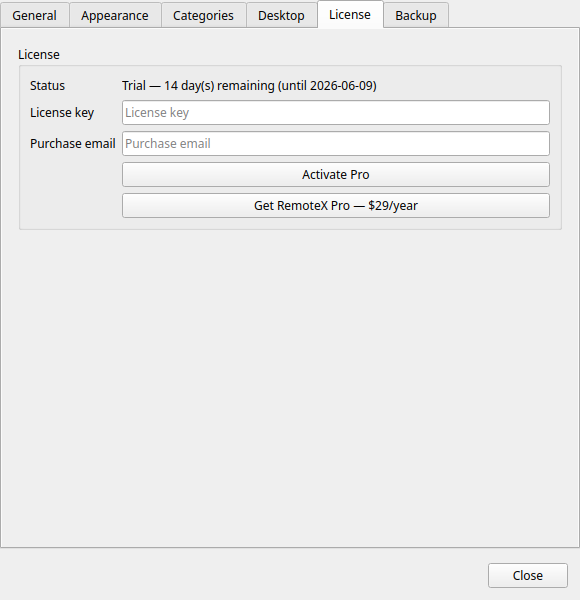

# Activar tu licencia

¡Bienvenido a Commandeck Pro! Esta guía te acompaña en la primera activación de tu licencia.

!!! tip "Lo que necesitas"
    - Tu **clave de licencia** (te llegó en el correo de compra de LemonSqueezy)
    - La **dirección de correo** que usaste al comprar
    - **Conexión a internet** (solo para la primera activación)

---

## Descargar e instalar

El correo de compra de LemonSqueezy incluye un enlace **Files** y un botón de descarga. También puedes coger la versión más reciente cuando quieras desde la [página de versiones](https://github.com/neurocontrarian/commandeck/releases/latest): Linux, macOS y Windows están todos ahí. Elige el archivo de tu sistema y sigue la pestaña correspondiente.

=== "Linux"
    Descarga `Commandeck-Pro-…-x86_64.AppImage` (o el archivo `-ARM64` si estás en una Raspberry Pi u otra máquina ARM).

    **La forma fácil, sin terminal:** clic derecho en el archivo descargado → **Propiedades** → pestaña **Permisos** → marca **«Permitir ejecutar el archivo como un programa»** (en algunos escritorios se llama **«Es ejecutable»**). Cierra la ventana y **haz doble clic** en el archivo para abrir Commandeck.

    ¿Prefieres la terminal? Lo mismo en una línea:
    ```bash
    chmod +x Commandeck-Pro-*.AppImage && ./Commandeck-Pro-*.AppImage
    ```

    !!! info "Si no arranca"
        El AppImage es autónomo: Python, Qt y todas las bibliotecas SSH (Paramiko,
        cryptography…) van dentro, así que no hay ningún `pip install` que hacer. Si tu
        distribución avisa de que falta el complemento de plataforma de Qt, instala
        `libxcb-cursor0`:
        ```bash
        sudo apt install libxcb-cursor0     # Ubuntu / Mint / Debian
        sudo dnf install xcb-util-cursor    # Fedora
        ```

=== "macOS"
    Abre el `.dmg` descargado y arrastra el icono de **Commandeck** a la carpeta **Aplicaciones** que aparece al lado.

    **Solo la primera vez**, abre Commandeck desde Aplicaciones con **clic derecho → Abrir → Abrir**. Así se quita el aviso de «desarrollador no identificado» que macOS muestra una vez para las aplicaciones instaladas fuera de la App Store. Después, ábrelo con normalidad.

=== "Windows"
    Ejecuta el instalador `.exe` descargado y sigue los pasos.

    Si SmartScreen muestra el recuadro azul **«Windows protegió tu PC»**, pulsa **Más información → Ejecutar de todas formas**. Aparece con las aplicaciones nuevas que Microsoft todavía no ha visto descargar muchas veces: es lo normal en una versión recién publicada.

---

## Activación paso a paso

1. **Abre Commandeck** y asegúrate de estar usando la **versión Pro**, no la gratuita. ([¿Cuál es la diferencia?](../pro.md#free-vs-pro))

2. **Abre Preferencias** con `Ctrl + ,` o desde el menú → *Preferencias*.

3. **Baja hasta la sección *Licencia*.**

    

4. **Pega tu clave de licencia** en el campo *Clave de licencia*.

5. **Escribe el correo** que usaste al comprar en el campo *Correo electrónico*.

    !!! warning "El correo debe coincidir exactamente"
        Comparamos lo que escribes con el correo que LemonSqueezy tiene registrado en la compra. Si no coincide, la activación se rechaza y no se consume ninguna plaza.

6. Pulsa **Activar Pro**.

7. En unos segundos, la ventana se actualiza y muestra:
    - El **tipo** de licencia
    - Tu **número de activaciones** (por ejemplo, *1 / 3*)

Ya está: todas las funciones Pro están desbloqueadas. Máquinas SSH, botones multimáquina, temas, copias de seguridad, servidor MCP, todo disponible.

---

## Qué pasa después

| Cuándo | Qué ocurre |
|---|---|
| Justo después de activar | Todas las funciones Pro se desbloquean al instante |
| Una vez al mes, más o menos, al arrancar | Commandeck confirma discretamente que tu licencia sigue activa. No hay nada que hacer, y estar sin conexión nunca te deja fuera. |

Tus datos nunca corren peligro. Botones, máquinas, ajustes: todo se conserva pase lo que pase con la licencia.

---

## Resolución de problemas

### *«Esta clave de licencia está registrada con otro correo.»*

El correo que has escrito no coincide con el de la compra en LemonSqueezy. Mira el recibo que te envió LemonSqueezy y usa exactamente esa dirección (las mayúsculas dan igual, las erratas no).

### *«Has alcanzado el máximo de 3 activaciones.»*

Has usado las 3 plazas de esta licencia. Abre Commandeck en uno de tus dispositivos activos, ve a **Preferencias → Licencia → Desactivar**, y vuelve a activar aquí.

¿Has perdido el acceso a un dispositivo que estaba activado (portátil perdido, sistema reinstalado sin desactivar)? [Escribe al soporte](mailto:neurocontrarian@gmail.com) y lo resolvemos contigo.

Consulta la [guía completa de Licencia y dispositivos](license-devices.md) para todos los casos.

### *«Error de red: no se ha podido contactar con el servidor de licencias.»*

La primera activación **necesita** conexión a internet (comprobamos la clave contra LemonSqueezy). Asegúrate de que Commandeck puede llegar a `api.lemonsqueezy.com`: los proxies corporativos y los cortafuegos estrictos pueden bloquearlo.

Después de la primera activación, Commandeck funciona **sin conexión indefinidamente**: estar desconectado nunca te deja fuera. Solo vuelve a comprobar la licencia **una vez al mes**, aproximadamente, al arrancar, y si esa comprobación no llega a internet simplemente se salta hasta la próxima vez.

### *No veo ninguna sección «Licencia» en Preferencias*

Estás usando la **versión gratuita**, que no tiene sistema de licencias: no hay nada que activar. Para usar Pro, [descarga la versión Pro](../pro.md#download) y ábrela en su lugar. Tus botones, máquinas y ajustes se recogen automáticamente (misma carpeta de configuración).

---

## Por dónde seguir

- **[Añade tu primera máquina SSH](../reference/ssh-machines.md)**: la función Pro por la que casi todo el mundo empieza
- **[Crea un botón multimáquina](../reference/ssh-machines.md#assigning-machines-to-a-button)**: un comando para todo un parque
- **[Licencia y dispositivos](license-devices.md)**: todo sobre el límite de 3 dispositivos, las reinstalaciones y las mudanzas
- **[Política de reembolso](../legal/refund.md)**: la garantía de 14 días y qué cubre

¿Necesitas algo más? [Escribe al soporte](mailto:neurocontrarian@gmail.com): leemos todos los mensajes.
