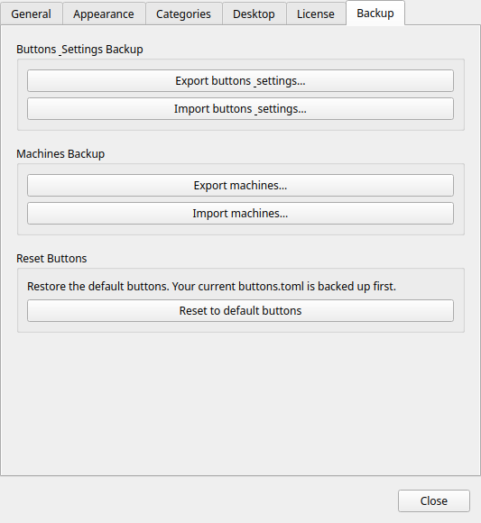

# Sauvegarde & Restauration

!!! tip "Fonctionnalité Pro"
    La sauvegarde et la restauration de la configuration nécessitent [Commandeck Pro](../pro.md).

Commandeck propose deux formats d'export distincts, intentionnellement séparés pour des raisons de sécurité.

Accédez aux deux depuis l'onglet **Préférences → Sauvegarde**.

---

## Sauvegarde des boutons — `.cdbackup`

Cette archive contient **uniquement vos boutons** :

- `buttons.toml` — tous vos boutons et leur configuration

Elle ne contient **pas** vos machines, ni votre licence Pro, ni vos paramètres des Préférences — importer un `.cdbackup` ne change que vos boutons. (Les machines ont leur propre fichier `.cdmachines`, ci-dessous.)

### Quand l'utiliser

- Avant un changement majeur (suppression de nombreux boutons, réorganisation des catégories)
- Lors de la migration de Commandeck vers un nouvel ordinateur
- Comme instantané périodique de votre bibliothèque de boutons

### Export

Cliquez sur **Exporter les boutons**. Un sélecteur de fichier s'ouvre. Choisissez un emplacement et enregistrez le fichier `.cdbackup`.

### Import

Cliquez sur **Importer des boutons** et sélectionnez un fichier `.cdbackup`. Commandeck vous demande comment importer :

- **Tout remplacer** — supprime vos boutons actuels et utilise ceux du fichier.
- **Ajouter les nouveaux** — garde vos boutons actuels et ajoute seulement ceux du fichier que vous n'avez pas déjà (identifiés par leur commande, donc réimporter le même fichier n'ajoute rien).

Dans les deux cas, vos boutons sont sauvegardés au préalable : l'import est annulable — voir **Restaurer les boutons précédents** ci-dessous.

!!! note
    En mode **Tout remplacer**, les boutons par défaut de *cette* plateforme absents du fichier sont rajoutés automatiquement : vous ne perdez jamais les boutons par défaut de votre plateforme.

### Annuler un import ou une réinitialisation

**Menu → Restaurer les boutons précédents** ramène vos boutons depuis la dernière sauvegarde automatique (créée à chaque import ou réinitialisation aux valeurs par défaut).

### Compatible entre plateformes

Un `.cdbackup` exporté sur **Linux, macOS, Windows ou Android s'importe sur n'importe quel autre** — le format est identique partout.

Ce qui n'est **pas** automatiquement portable, c'est le *texte de la commande* de chaque bouton : une commande écrite pour Linux (ex. `sudo apt upgrade`) ne tournera pas sur Windows, et inversement. Une sauvegarde est donc directement réutilisable quand l'OS cible est le même. Pour passer d'un OS à un autre :

- **Les boutons SSH fonctionnent tels quels** — la commande s'exécute sur la *machine distante*, donc elle ne dépend que de l'OS de cette machine, pas de l'appareil depuis lequel vous la déclenchez.
- Pour les boutons **locaux**, adaptez la commande au nouvel OS, ou appuyez-vous sur les boutons par défaut réinjectés à l'import.

### Comment le marqueur d'OS agit sur l'import et les machines

Chaque bouton porte l'OS pour lequel sa **commande** est écrite (Multiplateforme / Linux / macOS / Windows — réglable dans l'éditeur de bouton), et chaque machine porte son **OS hôte** (dans l'éditeur de machine). Deux mécanismes l'utilisent :

- **L'import garde les variantes d'OS côte à côte.** Un bouton est considéré « déjà présent » seulement si *à la fois* sa commande **et** son OS correspondent à un bouton que vous avez. Donc importer un jeu de boutons Windows sur une installation Linux **les ajoute** au lieu d'entrer en conflit avec vos boutons Linux — vous avez les deux. Réimporter le même jeu n'ajoute toujours rien.
- **La propagation n'apparie que les machines compatibles.** Quand vous ajoutez une machine à tous vos boutons, elle n'est attachée qu'aux boutons dont l'OS correspond à la machine (ou qui sont Multiplateforme). Une machine Windows ne se pose jamais sur un bouton à commande Linux. (Linux et macOS sont considérés compatibles, car ils partagent le même jeu de commandes par défaut.)

Un bouton laissé en **Multiplateforme** (le défaut pour les boutons que vous créez) s'apparie à n'importe quelle machine — ne le taguez Linux/macOS/Windows que si sa commande est spécifique à un OS.

---

## Sauvegarde des machines — `.cdmachines`

Cette archive contient :

- `machines.toml` — toutes les définitions de machines SSH (nom, hôte, utilisateur, port, chemin de la clé, icône)

### Ce qui n'est PAS inclus

Les **clés privées** SSH ne sont jamais exportées. L'archive ne stocke que le chemin vers le fichier de clé (`~/.ssh/id_ed25519`), pas la clé elle-même.

!!! warning
    Le fichier `.cdmachines` contient des noms d'hôtes, adresses IP, noms d'utilisateurs SSH et numéros de port. Traitez-le comme tout fichier de configuration réseau — ne le partagez pas publiquement et ne le stockez pas dans un emplacement public non chiffré.

### Quand l'utiliser

- Lors de la configuration de Commandeck sur un deuxième ordinateur (vous devrez quand même copier les clés SSH séparément)
- Comme archive de la configuration de votre infrastructure serveur

### Export

Cliquez sur **Exporter les machines**. Choisissez un emplacement et enregistrez le fichier `.cdmachines`.

### Import

Cliquez sur **Importer les machines**. Sélectionnez un fichier `.cdmachines`. Les machines sont fusionnées avec les machines existantes. Les doublons (même combinaison hôte + utilisateur) sont ignorés.

---

## Restauration sur un nouvel ordinateur

Liste de contrôle pour une migration complète :

1. Installez Commandeck sur la nouvelle machine
2. Copiez vos clés privées SSH dans `~/.ssh/` sur la nouvelle machine (utilisez `scp` ou une clé USB — gardez-les sécurisées)
3. Activez votre licence Pro dans les Préférences
4. Importez le fichier `.cdbackup` pour restaurer vos boutons
5. Importez le fichier `.cdmachines` pour restaurer les définitions des machines
6. Testez chaque connexion machine depuis **Menu → Gérer les machines → (sélectionner la machine) → Tester**
