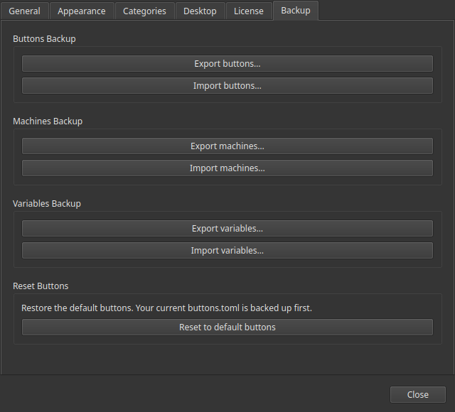

# Backup e ripristino

!!! tip "Funzione Pro"
    Il backup e il ripristino della configurazione richiedono [Commandeck Pro](../pro.md).

Commandeck offre tre formati di esportazione separati — pulsanti, macchine e valori di variabili salvati — tenuti apposta distinti per ragioni di sicurezza.

Li trovi nella scheda **Preferenze → Backup**.

---

## Backup dei pulsanti — `.cdbackup`

Questo archivio contiene **solo i tuoi pulsanti**:

- `buttons.toml`: tutti i tuoi pulsanti e la loro configurazione

**Non** contiene le tue macchine, né la tua licenza Pro, né le impostazioni delle Preferenze: importare un `.cdbackup` può cambiare soltanto i tuoi pulsanti. (Le macchine hanno il loro file `.cdmachines`, qui sotto.)

### Quando usarlo

- Prima di un cambiamento importante (cancellare molti pulsanti, riorganizzare le categorie)
- Quando porti Commandeck su un altro computer
- Come istantanea periodica della tua raccolta di pulsanti

### Esportare

Premi **Esporta i pulsanti**. Si apre un selettore di file: scegli dove salvare il `.cdbackup`.

### Importare

Premi **Importa pulsanti** e scegli un file `.cdbackup`. Commandeck ti chiede come importarlo:

- **Sostituisci tutto**: toglie i tuoi pulsanti attuali e usa quelli del file.
- **Aggiungi i nuovi**: mantiene i tuoi pulsanti attuali e aggiunge solo quelli del file che non hai ancora (il confronto avviene sul comando, quindi reimportare lo stesso file non aggiunge nulla).

In entrambi i casi i tuoi pulsanti vengono salvati prima, quindi l'importazione si può annullare: vedi **Ripristina i pulsanti precedenti**, più sotto.

!!! note
    Con **Sostituisci tutto**, i pulsanti predefiniti di *questa* piattaforma che mancano nel file vengono riaggiunti automaticamente, così non perdi mai quelli del tuo sistema.

### Annullare un'importazione o un ripristino

**Menu → Ripristina i pulsanti precedenti** recupera i tuoi pulsanti dall'ultimo backup automatico (creato ogni volta che importi o riporti tutto ai valori predefiniti).

### Funziona fra piattaforme diverse

Un `.cdbackup` esportato su **Linux, macOS, Windows o Android si importa su qualsiasi altro**: il formato è identico ovunque.

Ciò che **non** è automaticamente portabile è il *testo del comando* dentro ogni pulsante: un comando scritto per Linux (per esempio `sudo apt upgrade`) non funziona su Windows, e viceversa. Quindi un backup è riutilizzabile direttamente quando il sistema di destinazione è lo stesso. Per passare da un sistema all'altro:

- **I pulsanti SSH funzionano e basta**: il comando gira sulla *macchina remota*, quindi dipende solo dal sistema di quella macchina e non dal dispositivo da cui lo lanci.
- Per i pulsanti **locali**, adatta il comando al nuovo sistema oppure appoggiati ai pulsanti predefiniti della piattaforma, che vengono riseminati all'importazione.

### Come l'etichetta di sistema influisce su importazione e macchine

Ogni pulsante porta con sé il sistema per cui è scritto il suo **comando** (Multipiattaforma / Linux / macOS / Windows, si sceglie nell'editor dei pulsanti), e ogni macchina porta il **sistema del suo host** (nell'editor delle macchine). Serve a due cose:

- **L'importazione tiene affiancate le varianti per sistema.** Un pulsante conta come «già presente» solo quando coincidono *sia* il comando **sia** il sistema con uno che hai già. Quindi importare un insieme di pulsanti Windows su un'installazione Linux **li aggiunge** invece di scontrarsi con i tuoi pulsanti Linux: ti ritrovi con entrambi. Reimportare lo stesso insieme continua a non aggiungere nulla.
- **La propagazione abbina solo macchine compatibili.** Quando aggiungi una macchina a tutti i tuoi pulsanti, viene collegata soltanto a quelli il cui sistema corrisponde a quello della macchina (o che sono multipiattaforma). Una macchina Windows non finisce mai su un pulsante con un comando Linux. (Linux e macOS sono considerati compatibili, perché condividono lo stesso insieme di comandi predefiniti.)

Un pulsante lasciato su **Multipiattaforma** (l'impostazione normale per i pulsanti che crei tu) si abbina a qualsiasi macchina; etichettalo come Linux, macOS o Windows solo quando il suo comando è specifico di un sistema.

---

## Backup delle macchine — `.cdmachines`

Questo archivio contiene:

- `machines.toml`: tutte le definizioni delle macchine SSH (nome, host, utente, porta, percorso della chiave, icona)

### Che cosa NON è incluso

Le **chiavi private** SSH non vengono mai esportate. L'archivio conserva solo il percorso al file della chiave (`~/.ssh/id_ed25519`), non la chiave.

!!! warning
    Il file `.cdmachines` contiene nomi host, indirizzi IP, utenti SSH e numeri di porta. Trattalo come qualsiasi file di configurazione di rete: non condividerlo pubblicamente e non tenerlo senza cifratura in un posto accessibile.

### Quando usarlo

- Quando prepari Commandeck su un secondo computer (le chiavi SSH vanno comunque copiate a parte)
- Come registro della configurazione della tua infrastruttura di server

### Esportare

Premi **Esporta le macchine**. Scegli dove salvare il file `.cdmachines`.

### Importare

Premi **Importa macchine** e scegli un file `.cdmachines`. Le macchine vengono unite a quelle esistenti. I doppioni (stessa combinazione di host e utente) vengono saltati.

---

## Backup delle variabili — `.cdvariables`

Questo file contiene i tuoi **valori di variabili salvati**: le risposte riutilizzabili delle `{{variabili}}` che gestisci da **Menu → Valori delle variabili** (per esempio l'elenco dei nomi dei tuoi container). **Non** contiene né pulsanti né macchine.

### Esportare

Premi **Esporta le variabili**. Scegli dove salvare il file `.cdvariables`.

### Importare

Premi **Importa variabili** e scegli un file `.cdvariables`. I valori salvati vengono uniti ai tuoi: viene aggiunto ogni valore di una variabile che non hai ancora.

---

## Ripristinare su un computer nuovo

Elenco completo per il trasloco:

1. Installa Commandeck sulla macchina nuova
2. Copia le tue chiavi private SSH in `~/.ssh/` sulla macchina nuova (con `scp` o una chiavetta; tienile al sicuro)
3. Attiva la tua licenza Pro nelle Preferenze
4. Importa il file `.cdbackup` per recuperare i tuoi pulsanti
5. Importa il file `.cdmachines` per recuperare le definizioni delle macchine
6. Importa il file `.cdvariables` per recuperare i valori delle variabili
7. Prova ogni connessione da **Menu → Gestisci macchine → (scegli la macchina) → Prova**
