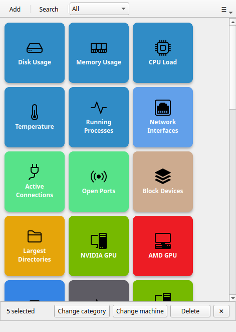

# Selección múltiple

!!! tip "Función Pro"
    La selección múltiple requiere [Commandeck Pro](../pro.md).

La selección múltiple te permite operar sobre varios botones a la vez: cambiarlos de categoría, reasignarles la máquina o borrar un grupo entero.

---

## Cuándo viene bien

- Has cambiado de servidor y necesitas reasignarle 10 botones
- Quieres mover todo un conjunto de botones a otra categoría
- Has creado un montón de botones temporales y quieres borrarlos de golpe
- Has duplicado varios botones y necesitas limpiar deprisa

---

## Empezar una selección

No hay ningún «modo selección» que activar. Basta con empezar a seleccionar:

- **Ctrl+clic** en una casilla para añadirla a la selección, o quitarla (un clic normal sigue ejecutando el comando)
- **Arrastra un recuadro** por una zona vacía de la cuadrícula (consulta [Selección con recuadro](#rubber-band-selection)) para seleccionar todas las casillas que toque

En cuanto hay un botón seleccionado, **una barra de acciones sube desde abajo** mostrando cuántos botones tienes seleccionados y qué acciones en grupo están disponibles.

---

## Seleccionar botones

### Ctrl+clic para marcar y desmarcar

**Ctrl+clic** en cualquier casilla la añade a la selección; otro Ctrl+clic la quita. Las casillas seleccionadas se destacan en azul. (Un clic izquierdo normal, sin Ctrl, ejecuta el comando del botón.)

### Selección con recuadro

Haz clic y arrastra sobre una **zona vacía** de la cuadrícula (no sobre un botón) para dibujar un rectángulo de selección. Todos los botones que toque el rectángulo se añaden a la selección actual.

!!! tip
    Empieza el arrastre desde los márgenes de la cuadrícula: el espacio entre casillas o el borde exterior. Si empiezas encima de un botón, lo que haces es marcar o desmarcar ese botón en lugar de dibujar un rectángulo.

### Combinar los dos métodos

Puedes mezclar Ctrl+clic y recuadro sin problema. Marca primero botones sueltos con Ctrl+clic, luego añade un grupo con el recuadro y después desmarca alguno con Ctrl+clic.

---

## Acciones en grupo

La barra inferior muestra las operaciones disponibles en cuanto hay al menos un botón seleccionado.

### Borrar

Elimina definitivamente todos los botones seleccionados. Una ventana de confirmación indica cuántos son («¿Borrar 5 botones?»). No se puede deshacer.

Los botones por defecto (Esenciales de Linux, Desarrollo) se pueden borrar incluso en la versión gratuita.

### Categoría

Asigna una categoría a todos los botones seleccionados. Una pequeña ventana pide el nombre:

- Escribe un nombre nuevo para crear una categoría
- Escribe el nombre de una categoría existente para mover los botones a ella
- Déjalo en blanco y confirma para quitarles la categoría (los botones quedan sin categoría)

### Máquina

Asigna una máquina SSH a todos los botones seleccionados. Un selector enumera tus máquinas configuradas más **Local**:

- Elige una máquina → todos los botones seleccionados pasan a apuntar solo a esa máquina (sus destinos anteriores se sustituyen)
- Elige **Local** → todos los botones seleccionados pasan a ejecución local

!!! note
    La acción **Máquina** sustituye el destino de cada botón, no lo añade. Si quieres botones multimáquina, edítalos uno a uno en el editor de botones.

---

## Deshacer la selección

Pulsa la **✕** de la barra de acciones para vaciar la selección actual. La barra se esconde y la cuadrícula vuelve a la normalidad. (Un clic normal en cualquier botón ejecuta su comando en cualquier momento: seleccionar botones nunca estorba al uso corriente.)
