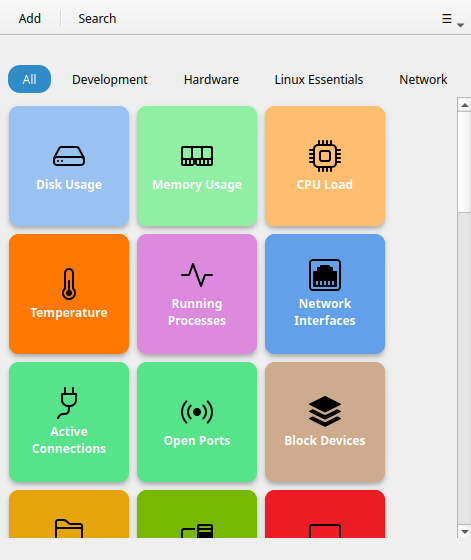
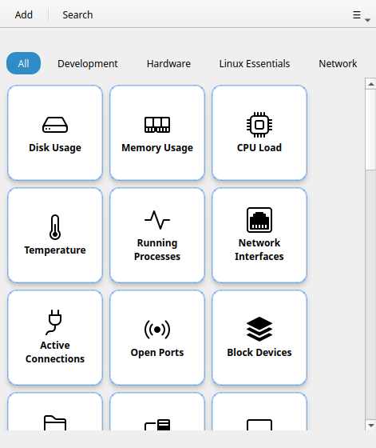
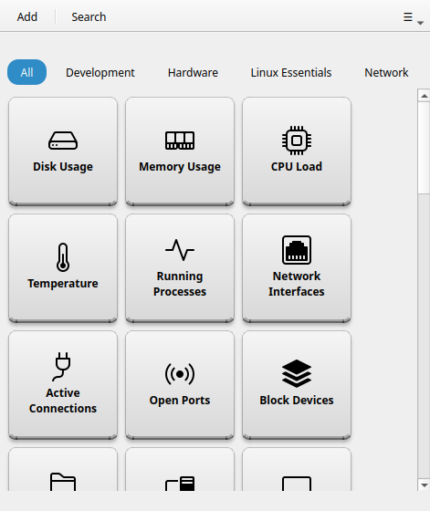
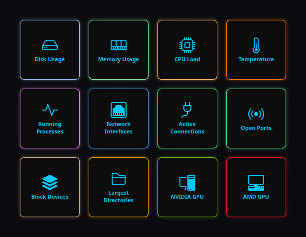
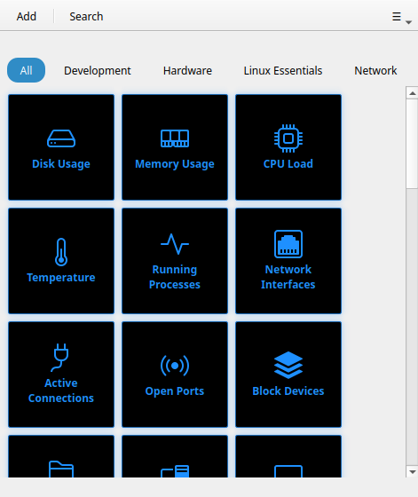
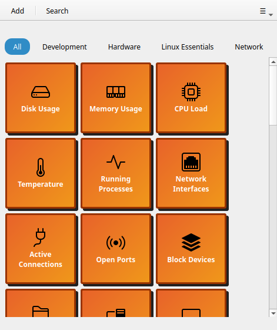

# Temas de botones

!!! tip "Función Pro"
    Los temas de botones requieren [Commandeck Pro](../pro.md). La versión gratuita se queda con el tema **Bold**.

Los temas de botones cambian el estilo visual de todas las casillas de la cuadrícula. Elige uno en **Preferencias → Aspecto de los botones → Tema de botones**.

---

## Temas disponibles

Hay seis temas. **Bold** y **Neon** conservan el color propio de cada botón; **Cards**, **Phone keys**, **Retro** y **Tron** aplican un estilo uniforme y no hacen caso de los colores individuales.

### Bold (por defecto)

Casillas de color sólido con mucho contraste: el color de fondo de cada botón como relleno plano y texto blanco en negrita. Es el estilo por defecto y funciona bien tanto en modo claro como oscuro.



### Cards

Casillas claras al estilo de fichas, con un borde suave teñido del color de acento. Limpio y neutro: buena elección si los colores de Bold te resultan demasiado fuertes.



### Phone keys

Teclas compactas y redondeadas con una sombra suave, que recuerdan al teclado de un teléfono o de una calculadora. Va mejor con botones de tamaño pequeño o mediano.



### Neon

El color propio de cada botón sobre negro: borde y halo brillantes en ese color, con el texto en cian. Se aviva al pasar el ratón. Muy agradecido en modo oscuro.



!!! note
    El halo de Neon se aprecia mejor en marcha: al pasar el ratón por encima, el borde del botón se ilumina.

### Tron

Casillas negras con contornos y texto en cian brillante, con aire de rejilla luminosa. No hace caso de los colores individuales: todas las casillas comparten el mismo estilo de neón sobre negro.



### Retro

Monocromo ámbar con un borde desplazado y duro, inspirado en las terminales antiguas. No hace caso de los colores individuales: todas las casillas se ven igual a propósito.



---

## CSS personalizado

!!! tip "Función Pro"
    El CSS personalizado requiere [Commandeck Pro](../pro.md).

Para un control visual completo, carga tu propia hoja de estilos. Indica la ruta en **Preferencias → Aspecto de los botones → Archivo CSS personalizado → Examinar**. Commandeck usa **hojas de estilo de Qt (QSS)**: una sintaxis parecida al CSS, pero con los selectores propios de Qt y menos propiedades que el CSS de la web.

Cuando se carga una hoja de estilos propia, se aplica encima del tema elegido. Puedes combinar un tema de base con pequeños retoques, o escribir un tema entero desde cero.

### Elementos a los que puedes apuntar

Un botón es un `QFrame` llamado `ButtonTile` que contiene un `QLabel` llamado `TileLabel`. Sus estados (en ejecución, correcto, error, seleccionado) se exponen como **propiedades dinámicas** que se seleccionan con `[propiedad="valor"]`:

```css
/* The tile container */
QFrame#ButtonTile {
  background: #1e1e2e;
  border-radius: 12px;
  border: 2px solid rgba(255, 255, 255, 0.15);
}

/* Hover state */
QFrame#ButtonTile:hover {
  border-color: rgba(137, 180, 250, 0.8);
}

/* Pressed state */
QFrame#ButtonTile:pressed {
  background: #181825;
}

/* The label text */
QFrame#ButtonTile QLabel#TileLabel {
  color: #cdd6f4;
  font-weight: bold;
  font-size: 13px;
}

/* Running state (command is executing) */
QFrame#ButtonTile[running="true"] {
  background: #313244;
}

/* Success flash */
QFrame#ButtonTile[success="true"] {
  border-color: #a6e3a1;
}

/* Failure flash */
QFrame#ButtonTile[error="true"] {
  border-color: #f38ba8;
}

/* Selected (multi-select) */
QFrame#ButtonTile[selected="true"] {
  border-color: #89b4fa;
}
```

Pulsa **Exportar plantilla** en Preferencias para descargar un archivo de partida con todos los selectores disponibles y sus valores por defecto comentados.

!!! note
    Las hojas de estilo de Qt no son CSS de la web: **no** existen `transform`, `box-shadow`, las transiciones de `opacity`, la unidad `rem` ni `max-width` / `max-height`. Usa colores sólidos, bordes y `border-radius`; y da los tamaños en píxeles.
