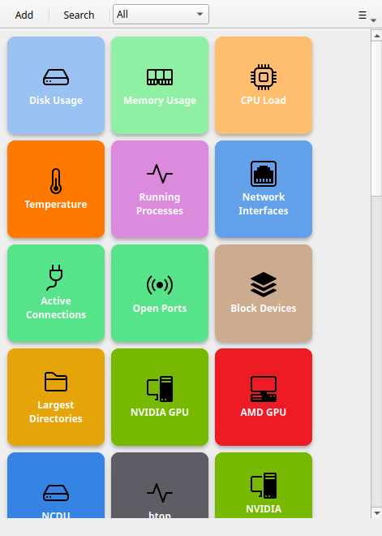

# Avvio rapido

Metti in funzione Commandeck e crea il tuo primo pulsante in circa due minuti.

## 1. Apri Commandeck

Dopo aver [installato Commandeck](installation.md), aprilo: cerca **Commandeck** nel menu
delle applicazioni (oppure avvia l'AppImage che hai scaricato).

Al primo avvio la griglia si riempie di **pulsanti già pronti**, organizzati in categorie come
Hardware, Rete e Sviluppo (l'insieme esatto dipende dal tuo sistema operativo). Non c'è nulla
da configurare: premine uno e il comando parte subito.

## 2. Premi un pulsante predefinito

Premi **Spazio su disco** per vedere a colpo d'occhio come stanno i tuoi dischi. Un
messaggio a comparsa conferma che ha funzionato.

Quando un comando produce del testo (come questo), il risultato compare da solo in una
piccola finestra.

## 3. Crea il tuo primo pulsante

1. Premi **Ctrl+N** (oppure il **+** nella barra in alto)
2. Compila **Etichetta**: il testo che apparirà sul pulsante
3. Compila **Comando**: un qualsiasi comando di sistema, per esempio `ping -c 4 8.8.8.8`
4. Premi **Salva**

Il pulsante compare nella griglia. Premilo per eseguire il comando.

!!! tip
    La versione gratuita include **pulsanti locali illimitati**. [Commandeck Pro](pro.md)
    aggiunge macchine SSH, temi e IA.

## 4. Fai ordine con le categorie

Nell'editor dei pulsanti, scrivi un nome nel campo **Categoria** (per esempio `Rete`). Nella
barra in alto comparirà un menu a tendina: sceglila lì per filtrare la griglia.

## 5. Prossimi passi

| Cosa vuoi fare | Dove guardare |
|----------------|---------------|
| Capire ogni campo di un pulsante | [Editor dei pulsanti](reference/button-editor.md) |
| Conoscere tutta l'interfaccia | [Finestra principale](reference/main-window.md) |
| Collegare un server remoto | [Macchine SSH](reference/ssh-machines.md) |
| Regolare colonne, dimensioni e tema | [Preferenze](reference/preferences.md) |
| Vedere esempi concreti | [Casi d'uso](use-cases/index.md) |
