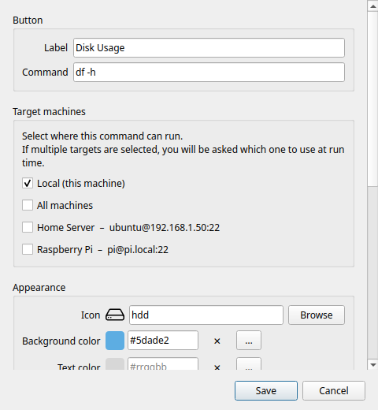

# Editor dei pulsanti

L'editor dei pulsanti si apre quando ne crei uno nuovo (**+** / `Ctrl+N`) o quando ne modifichi uno esistente (clic destro → **Modifica**).



---

## Etichetta

Il testo che compare sulla casella del pulsante nella griglia. Tienilo corto: le etichette lunghe vengono tagliate sulle caselle piccole.

---

## Comando

Il comando da eseguire. È una riga di comando completa. Esempi:

```bash
df -h                             # riepilogo dell'uso del disco
ping -c 4 8.8.8.8                 # controllare la connessione
sudo systemctl restart nginx      # riavviare un servizio
git -C ~/mioprogetto pull         # aggiornare un repository
tar -czf ~/backup.tar.gz ~/docs   # creare un archivio
```

Puoi usare le funzioni della shell: pipe (`|`), redirezioni (`>`), sostituzione di comandi (`$()`) e catene di più istruzioni (`&&`, `;`).

!!! warning
    I comandi vengono eseguiti con il tuo utente attuale (o con sudo, se lo includi nel comando). Non c'è nessuna sandbox: il comando ha pieno accesso ai tuoi file. Aggiungi solo comandi di cui ti fidi.

---

## Macchine di destinazione

Stabilisce dove viene eseguito il comando. L'elenco mostra **Locale** in cima, seguito da tutte le tue macchine SSH configurate.

**Locale**: viene eseguito sul tuo computer con un normale sottoprocesso. Non serve l'SSH.

**Macchina SSH**: attiva una o più macchine con i loro interruttori. Il comando viene eseguito su ogni macchina attivata via SSH.

- Se è attivo solo **Locale**: viene eseguito in locale, senza selettore.
- Se è attiva una sola macchina (e Locale è spento): viene eseguito direttamente lì, senza selettore.
- Se sono attive due o più destinazioni: alla pressione compare il [selettore di macchina](ssh-machines.md#the-machine-picker).

**Tutte le macchine**: un interruttore in cima all'elenco per attivarle o disattivarle tutte insieme (sceglie tutte le macchine *compatibili con il sistema* del comando).

### Sistema del comando

Il **sistema del comando** dice a Commandeck per quale sistema operativo è scritto: **Multipiattaforma** (predefinito, funziona ovunque), **Linux**, **macOS** o **Windows**. Serve a due cose:

- Nell'elenco delle macchine qui sopra, quelle che non corrispondono compaiono **in grigio** con un ⚠, così non puoi puntare per sbaglio un comando Linux su una macchina Windows (o viceversa). Una macchina che avevi già scelto resta visibile perché tu possa toglierla.
- All'[importazione](../pro/backup.md), la versione Linux e quella Windows dello stesso pulsante vengono conservate una accanto all'altra invece di scontrarsi.

Il sistema di ogni macchina si indica nel suo [editor](ssh-machines.md); Linux e macOS sono considerati compatibili. Lascia un pulsante su **Multipiattaforma** a meno che il suo comando non sia specifico di un sistema.

!!! tip "Funzione Pro"
    Aggiungere macchine SSH richiede [Commandeck Pro](../pro.md). Nella versione gratuita è disponibile solo **Locale**.

---

## Aspetto

### Icona

Scegli un'icona dal selettore integrato. Vengono mostrate solo le icone disponibili e visualizzabili sul tuo sistema.

Scrivi nel campo di ricerca per filtrarle per nome. L'icona scelta compare nell'anteprima del pulsante, in cima alla finestra.

Per togliere del tutto l'icona, attiva **Nascondi l'icona** (più sotto).

### Colore di sfondo

Il colore di riempimento della casella. Premi il campo del colore per aprire il selettore:

- Una tavolozza GNOME di 40 colori per scegliere in fretta
- Un campo esadecimale (`#rrggbb`) per i valori precisi

Lascialo vuoto per il colore di casella predefinito del sistema.

### Colore del testo

Il colore dell'etichetta del pulsante, indipendente dal colore di sfondo. Stesso selettore di sopra.

Lascialo vuoto per usare il colore di etichetta predefinito (che si adatta da solo alla modalità chiara o scura).

### Nascondi l'etichetta

Quando è attivo, l'etichetta sparisce e resta solo l'icona. Utile sulle caselle molto piccole o con icone riconoscibili al volo.

### Nascondi l'icona

Quando è attivo, l'icona sparisce e resta solo il testo. Utile quando nessuna icona è adatta o quando l'etichetta da sola è già chiara.

---

## Organizzazione

### Categoria

Scrivi il nome di una categoria per mettere questo pulsante in un gruppo. I pulsanti che condividono il nome della categoria si raggruppano sotto la stessa voce del [filtro per categoria](main-window.md#category-filter).

- I nomi distinguono maiuscole e minuscole (`Server` e `server` sono due categorie diverse)
- Lascialo vuoto per lasciare il pulsante senza categoria
- Per rinominare una categoria, modifica tutti i suoi pulsanti e cambia il nome

Anche il clic destro su un pulsante della griglia offre **Sposta in una categoria** per riassegnarlo in fretta.

---

## Comportamento

### Suggerimento

Testo personalizzato che compare passando il mouse sul pulsante. Se lo lasci vuoto, viene mostrato il comando stesso.

Usalo per aggiungere una spiegazione in parole umane quando il comando non si spiega da solo.

### Chiedi conferma prima di eseguire

Quando è attivo, premendo il pulsante compare una finestra di conferma («Eseguire questo comando?») prima che accada qualcosa. Utile per i comandi distruttivi: riavvii, spegnimenti o cancellazioni.

Il valore predefinito di questa opzione si imposta in **Preferenze → Generale → Chiedi conferma prima di eseguire, come impostazione predefinita**.

### Modalità di esecuzione

Stabilisce che cosa succede dopo l'esecuzione del comando.

| Modalità | Comportamento |
|----------|---------------|
| **Silenzioso** | Il comando gira in secondo piano. Un avviso a comparsa dice se è andata bene o male. |
| **Mostra l'output** | Alla fine del comando si apre una finestra con tutto il testo normale e quello di errore. |
| **Apri nel terminale** | Il comando viene lanciato nell'emulatore di terminale del tuo sistema (sessione interattiva completa). |

!!! tip
    **Mostra l'output** si apre da sola quando qualcosa fallisce, qualunque modalità tu abbia scelto: l'errore lo vedi sempre.

    Usa **Apri nel terminale** per i programmi interattivi: `htop`, `vim`, `python3`, sessioni `ssh` e simili.

### Profilo di esecuzione

!!! tip "Funzione Pro"
    I profili di esecuzione richiedono [Commandeck Pro](../pro.md).

Assegna a questo pulsante un [profilo di esecuzione](execution-profiles.md) salvato. Un profilo mette insieme un utente di destinazione, una cartella di lavoro e una password di sudo in un'unica voce riutilizzabile.

Quando è selezionato un profilo, i campi **Esegui come utente** e **Cartella di lavoro** del pulsante vengono sostituiti da quelli del profilo, e quei controlli passano automaticamente in grigio.

Scegli **Nessuno** per usare i campi propri del pulsante.

### Esegui come utente

Esegue il comando con un altro utente tramite `sudo -u <utente>`. Compila questo campo con un nome utente di sistema (per esempio `www-data` o `postgres`).

Viene ignorato quando è assegnato un profilo di esecuzione (comanda l'utente del profilo).

!!! note
    Per eseguire con un utente preciso *e* avere la password di sudo fornita da sola, usa un **profilo di esecuzione**: conserva la password in modo sicuro e la passa senza chiedere.

### Consenti all'IA di eseguire questo pulsante

!!! tip "Funzione Pro"
    Richiede [Commandeck Pro](../pro.md) e il [server MCP](../pro/mcp.md).

Disattivato di fabbrica. Quando è attivo — **e** l'esecuzione da parte dell'IA è attiva in *Preferenze → Integrazione con il desktop* — un assistente IA può lanciare questo pulsante via MCP. Abbinalo a **Chiedi conferma prima di eseguire** perché l'IA debba mostrarti il comando esatto e aspettare la tua approvazione. Vedi [Sicurezza](security.md) e [Consentire all'IA di eseguire i pulsanti](../pro/mcp.md#allowing-ai-to-run-buttons).

---

## Salvare

Premi **Salva** per confermare. Il pulsante compare subito nella griglia, nella prima posizione libera.

Per annullare senza salvare, premi `Esc` o fai clic fuori dalla finestra.
