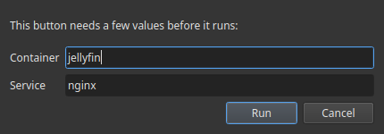

# Variables de comando

El comando de un botón puede contener **huecos** escritos como `{{clave}}`. Al pulsar el botón, Commandeck te pide cada valor, lo coloca y luego ejecuta el comando. El valor se usa **solo para esa ejecución**: nunca se guarda.

Así un pack compartido sigue siendo genérico (sin datos personales dentro): el pack trae `docker restart {{container}}`, y cada persona escribe el nombre de su propio contenedor al ejecutarlo.

## Cómo funciona

1. Un comando como `docker logs --tail {{lines}} {{container}}` tiene dos huecos.
2. Al pulsar, una pequeña ventana pide **Líneas** y **Contenedor**.
3. Escribes `50` y `jellyfin` → Commandeck ejecuta `docker logs --tail 50 jellyfin`.
4. No se guarda nada: la próxima vez vuelve a preguntar.

Un hueco se escribe como `{{clave}}` (letras, cifras, guion bajo). Los espacios dentro no molestan: `{{ container }}` también vale.

## Variables estándar

Estas claves ya traen una etiqueta y una pregunta claras. Reutilízalas para que la gente reciba siempre las mismas preguntas. La lista **crece con el tiempo**.

| Hueco | Pide | Efecto en el comando |
|---|---|---|
| `{{container}}` | Nombre de un contenedor Docker | sustituye `{{container}}` antes de ejecutar |
| `{{service}}` | Nombre de un servicio de systemd | sustituye `{{service}}` |
| `{{path}}` | Una ruta de archivo o de carpeta | sustituye `{{path}}` |
| `{{host}}` | Un nombre de anfitrión o una IP | sustituye `{{host}}` |
| `{{port}}` | Un número de puerto | sustituye `{{port}}` |
| `{{branch}}` | Un nombre de rama de Git | sustituye `{{branch}}` |
| `{{package}}` | Un nombre de paquete | sustituye `{{package}}` |
| `{{user}}` | Un nombre de usuario | sustituye `{{user}}` |
| `{{pid}}` | Un identificador de proceso | sustituye `{{pid}}` |
| `{{lines}}` | Un número de líneas | sustituye `{{lines}}` |
| `{{player}}` | Un nombre de jugador | sustituye `{{player}}` |
| `{{message}}` | Un mensaje | sustituye `{{message}}` |

## Otras variables (escritas en el comando)

Puedes escribir **cualquier** clave directamente en un comando, por ejemplo `{{region}}`. Si no es una variable estándar, Commandeck te la pide igualmente al ejecutar, con un campo de texto normal etiquetado con el nombre de la clave: así los packs que usan sus propias claves siguen funcionando.

Ojo: el gestor de **Valores de variables** y el selector **Insertar variable** solo enumeran las variables estándar de arriba; desde ahí no se pueden crear claves nuevas. Las claves propias viven en el texto del comando.

## Valores guardados (más rápido y más constante)

Puedes guardar una lista de valores por variable en **Menú → Valores de variables** (por ejemplo, `service` → `jellyfin`, `sonarr`). Entonces:

- **Al crear un botón**, el botón **Insertar variable** (junto al campo Comando) te deja insertar `{{service}}` (se preguntará en cada ejecución) **o elegir un valor guardado para dejarlo fijo** en el comando desde ya.
- **Al ejecutar**, una variable que tenga valores guardados muestra un **desplegable** con ellos, y aun así puedes escribir a mano cualquier otro valor.

## No pongas secretos en un comando

Nunca escribas una contraseña real o una clave de API en un comando. Si un comando necesita una, usa un hueco (por ejemplo `{{token}}`) para que se escriba al ejecutar y no se guarde ni se comparta en un pack. Los packs enviados con un secreto literal dentro se rechazan automáticamente.
