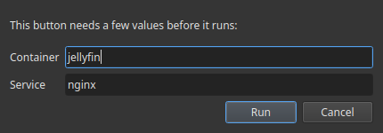

# Command variables

A button command can contain **placeholders** written as `{{key}}`. When you click the
button, Commandeck asks you for each value, fills it in, and then runs the command. The
value is used **only for that run** — it is never saved.

This keeps a shared pack generic (no personal data baked in): the pack ships
`docker restart {{container}}`, and each person types their own container name at run time.

## How it works

1. A command like `docker logs --tail {{lines}} {{container}}` has two placeholders.
2. On click, a small window asks for **Lines** and **Container**.
3. You type `50` and `jellyfin` → Commandeck runs `docker logs --tail 50 jellyfin`.
4. Nothing is stored — next time it asks again.

Write a placeholder as `{{key}}` (letters, digits, underscore). Spaces inside are fine:
`{{ container }}` works too.

## Standard variables

These keys have a friendly label and prompt built in. Reuse them so users get consistent
questions. The list **grows over time**.

| Placeholder | Asks for | Effect on the command |
|---|---|---|
| `{{container}}` | Docker container name | replaces `{{container}}` before running |
| `{{service}}` | systemd service name | replaces `{{service}}` |
| `{{path}}` | a file or directory path | replaces `{{path}}` |
| `{{host}}` | a hostname or IP address | replaces `{{host}}` |
| `{{port}}` | a port number | replaces `{{port}}` |
| `{{branch}}` | a Git branch name | replaces `{{branch}}` |
| `{{package}}` | a package name | replaces `{{package}}` |
| `{{user}}` | a user name | replaces `{{user}}` |
| `{{pid}}` | a process ID | replaces `{{pid}}` |
| `{{lines}}` | a number of lines | replaces `{{lines}}` |
| `{{player}}` | a player name | replaces `{{player}}` |
| `{{message}}` | a message | replaces `{{message}}` |

## Other variables (typed in the command)

You can still type **any** key directly in a command, e.g. `{{region}}`. If it isn't a
standard variable, Commandeck still asks for it at run time with a plain text box labelled
from the key name — so packs that use their own keys keep working.

Note: the **Variable Values** manager and the **Insert variable** picker only list the
standard variables above — you can't create new variable keys from them. Custom keys live
in the command text itself.

## Saved values (faster, consistent)

You can save a list of values per variable in **Menu → Variable Values** (e.g. `service` →
`jellyfin`, `sonarr`). Then:

- **When building a button**, the **Insert variable** button (next to the Command field)
  lets you either insert `{{service}}` (asked each run) **or pick a saved value to freeze it**
  into the command now.
- **At run time**, a variable that has saved values shows a **dropdown** of them — and you
  can still type any other value by hand.

## Don't put secrets in a command

Never write a real password or API key in a command. If a command needs one, use a
placeholder (e.g. `{{token}}`) so it's typed at run time and never stored or shared in a
pack. Pack submissions that embed a literal secret are rejected automatically.
