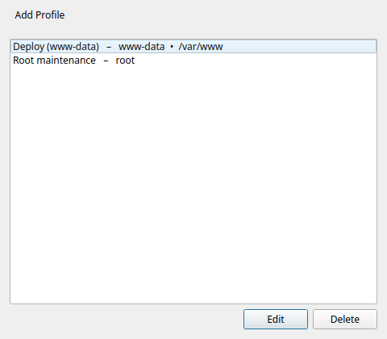
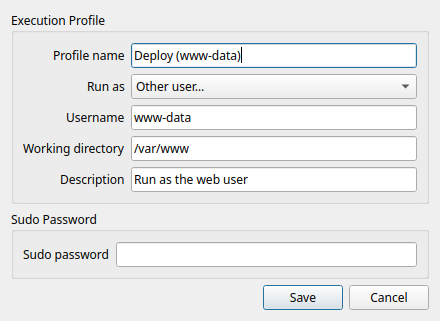

# Perfiles de ejecución

!!! tip "Función Pro"
    Los perfiles de ejecución requieren [Commandeck Pro](../pro.md).

🔰 **En pocas palabras:** un perfil es un pequeño conjunto de «condiciones de ejecución» que guardas una vez y reutilizas en muchos botones: *quién* ejecuta el comando (otro usuario) y *dónde* se ejecuta (una carpeta). En lugar de escribir `sudo -u www-data` y `cd /var/www` en cada botón, lo pones una vez en un perfil y eliges ese perfil en el botón.

## Crear un perfil

Abre **Menú ☰ → Perfiles de ejecución → Añadir** y rellena:

| Campo | Para qué sirve |
|-------|----------------|
| **Nombre** | Cómo aparece el perfil en el desplegable del editor de botones. |
| **Ejecutar como usuario** | Ejecuta el comando con ese usuario en lugar del tuyo (usa `sudo -u <usuario>`). Déjalo vacío para ejecutarlo tú. |
| **Carpeta de trabajo** | La carpeta en la que arranca el comando (como si hicieras `cd` allí antes). |
| **Descripción** | Nota opcional para recordarte para qué es el perfil. |
| **Contraseña de sudo** | Opcional. Solo hace falta cuando *Ejecutar como usuario* pide contraseña. Se guarda en local, cifrada; consulta [Seguridad](security.md). |

## Usar un perfil en un botón

En el [editor de botones](button-editor.md), elige tu perfil en el desplegable **Perfil de ejecución**. El botón se ejecuta ahora con el usuario y la carpeta de ese perfil, y el campo del comando se queda limpio, solo con el comando de verdad.

!!! example "Antes y después"
    En lugar de un botón con `sudo -u www-data bash -c 'cd /var/www/app && git pull'`, crea:

    - un perfil **Despliegue web** → *Ejecutar como usuario* `www-data`, *Carpeta de trabajo* `/var/www/app`
    - un botón con el comando `git pull` y el perfil **Despliegue web**

    Más limpio, y el mismo perfil sirve para todos los botones de esa aplicación web.

!!! example "Apagar una máquina remota, el caso clásico"
    Usado por SSH (por ejemplo desde el móvil), el botón **Apagar** que viene por defecto falla con un mensaje sobre autenticación. El comando está bien: apagar una máquina necesita **permisos de administrador**, y una conexión remota no los recibe sola como cuando estás sentado delante del ordenador. (En tu propio escritorio, ese mismo botón funciona sin más.) Con **Reiniciar** pasa igual.

    La solución es un perfil, no otro comando:

    - crea un perfil **Energía (administrador)** → *Ejecutar como usuario* `root`, y escribe la **Contraseña de sudo** de esa máquina (tu contraseña en ella)
    - asígnaselo a **Apagar** (y a **Reiniciar**), sin tocar el comando

    El botón se ejecuta ahora con permisos de administrador y apaga la máquina limpiamente. Ese mismo perfil te sirve luego para cualquier cosa que necesite permisos de administrador en una máquina remota: reiniciar un servicio, instalar programas, montar un disco.

⚙️ **Para administradores de sistemas**

- *Ejecutar como usuario* envuelve el comando con `sudo -u <usuario>`. Si ese destino pide contraseña, rellena la **Contraseña de sudo** del perfil; Commandeck la pasa con `sudo -S` en el momento, así que no aparece ninguna petición en una terminal.
- Un perfil se aplica **igual** en local que por SSH: el envoltorio `sudo -u` y la carpeta de trabajo se aplican en la máquina a la que apunte el botón.
- Los perfiles casan de forma natural con los [botones multimáquina](../use-cases/homelab.md): un perfil de despliegue, un botón, varios servidores.
- Un asistente de IA puede crear y asignar perfiles por ti mediante el [servidor MCP](../pro/mcp.md): descompone automáticamente una línea de comandos pegada en un perfil más un comando limpio.
