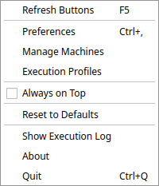
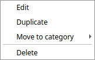
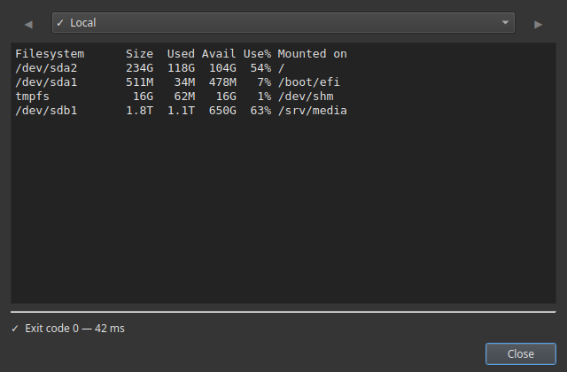

# Ventana principal

La ventana principal tiene tres zonas: la **barra superior**, la **barra de búsqueda** y la **cuadrícula de botones**.

---

## Barra superior

La barra superior está siempre a la vista. De izquierda a derecha:

### + (Añadir botón)

Abre el [editor de botones](button-editor.md) para crear uno nuevo. Atajo de teclado: `Ctrl+N`.

!!! note
    Los botones personalizados son ilimitados en todas las versiones. [Commandeck Pro](../pro.md) añade máquinas SSH, temas e integración con IA.

### Icono de búsqueda

Muestra u oculta la barra de búsqueda. También puedes empezar a escribir en cualquier parte de la ventana para que se abra sola.

### Menú (≡)

Abre el menú de la aplicación:

- **Recargar los botones** (`F5`): vuelve a leer la cuadrícula del disco sin reiniciar; útil después de que una IA (MCP) u otro programa haya cambiado tus botones
- **Preferencias**: abre el diálogo de preferencias (`Ctrl+,`)
- **Gestionar máquinas**: abre la lista de máquinas (solo Pro)
- **Perfiles de ejecución**: abre la lista de perfiles de ejecución (solo Pro)
- **Siempre visible**: hace que la ventana flote por encima de las demás (se queda marcado cuando está activo)
- **Restablecer los valores por defecto**: hace una copia de tus botones y vuelve a sembrar el conjunto por defecto
- **Ver el registro de ejecución**: abre el registro de diagnóstico que sigue cada clic
- **Acerca de**: versión y datos de licencia
- **Salir**: cierra Commandeck (`Ctrl+Q`)

---

## Filtro de categorías

Cuando al menos un botón tiene categoría, aparece un **desplegable de categorías** en la barra superior, junto al icono de búsqueda. (Se esconde si ningún botón tiene categoría.)

- **Todas**: la opción por defecto, muestra todos los botones sin importar su categoría.
- **_(nombre de la categoría)_**: elige una categoría para ver solo sus botones.

El desplegable mantiene el mismo tamaño compacto por muchas categorías que tengas, así que la ventana puede encogerse hasta una sola columna de botones.

Para esconder una categoría del todo — que no salga ni en el desplegable ni en la cuadrícula — ve a **Preferencias → Categorías** y desactívala. Los botones no se borran.

---

## Barra de búsqueda

La barra de búsqueda aparece debajo de la barra superior cuando la activas. Filtra los botones en tiempo real por su etiqueta. El filtro se aplica encima del filtro de categoría que tengas activo.

Pulsa `Esc` o el icono de búsqueda otra vez para cerrarla y quitar el filtro.

---

## Cuadrícula de botones

La zona principal es una cuadrícula de [casillas](#button-tiles) con desplazamiento. No hay ningún ajuste de «columnas»: la cuadrícula se recoloca sola según el ancho de la ventana. Haz la ventana más ancha para tener más columnas, o más estrecha para tener menos (hasta una sola columna). Para cambiar el tamaño de las casillas, usa **Preferencias → Aspecto de los botones → Tamaño de botón**.

Arrastra y suelta cualquier botón para cambiarlo de sitio dentro de la cuadrícula.

### Casillas de botón

Cada casilla muestra:

- Un **icono** (arriba o en el centro, según el tamaño)
- Una **etiqueta** (el nombre del botón)

El fondo de la casilla y el color del texto se pueden ajustar botón a botón.

**Clic izquierdo** en una casilla para ejecutar el comando. Si el botón tiene activado **Confirmar antes de ejecutar**, aparece antes una ventana de confirmación. Si el botón apunta a varias máquinas, aparece un [selector de máquina](ssh-machines.md#the-machine-picker).

**Clic derecho** en una casilla para abrir el menú contextual:

- **Editar**: abre el editor de este botón
- **Duplicar**: crea una copia del botón
- **Mover a una categoría**: escribe o elige el nombre de una categoría para reasignarlo
- **Borrar**: elimina el botón definitivamente (con confirmación)

!!! note
    Los botones por defecto se pueden editar del todo, y por todo el mundo: renómbralos, cámbiales el color, cambia su comando o bórralos, también en la versión gratuita.

### Seleccionar varios botones a la vez

No hay ningún botón de «modo selección». Para trabajar sobre varios botones a la vez:

- **Ctrl+clic** en las casillas para añadirlas o quitarlas de la selección, o
- **arrastra un recuadro** por la cuadrícula (haz clic en una zona vacía y arrastra) para seleccionar todas las casillas que toque.

En cuanto hay un botón seleccionado, **una barra de acciones sube desde abajo** mostrando cuántos hay seleccionados, con las acciones en grupo: **Cambiar de categoría**, **Cambiar de máquina**, **Borrar** y **✕** para vaciar la selección.

!!! tip "Función Pro"
    Seleccionar varios botones a la vez requiere [Commandeck Pro](../pro.md).

---

## Avisos emergentes

Después de ejecutar un comando, un pequeño aviso sube desde la parte inferior de la ventana:

- **Aviso de éxito**: el comando ha terminado bien
- **Aviso de fallo**: el comando ha fallado (código de salida distinto de cero)

Con los comandos en modo **Mostrar la salida**, o con cualquier comando que falle, se abre sola una ventana de salida con todo el texto normal y el de errores.

---

## Cuando no hay nada que mostrar

Si ningún botón coincide con la búsqueda o el filtro de categoría, se muestra una ilustración con una pista. No es un error: solo quiere decir que todos los botones están filtrados. Pulsa **Todas** o borra la búsqueda para volver a verlos.

Si no tienes ningún botón (algo raro tras una instalación nueva), esa pantalla te invita a crear el primero.
