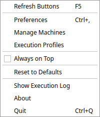
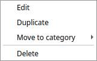

# Fenêtre principale

La fenêtre principale est divisée en trois zones : la **barre d'en-tête** (barre d'outils), la **barre de recherche** et la **grille de boutons**.

---

## Barre d'en-tête

La barre d'en-tête est toujours visible. De gauche à droite :

### + (Ajouter un bouton)

Ouvre l'[Éditeur de bouton](button-editor.md) pour créer un nouveau bouton. Raccourci clavier : `Ctrl+N`.

!!! note
    Les boutons personnalisés sont illimités dans toutes les versions. [Commandeck Pro](../pro.md) ajoute les machines SSH, les thèmes et l'intégration IA.

### Icône de recherche

Affiche ou masque la barre de recherche. Vous pouvez également commencer à taper n'importe où dans la fenêtre pour l'ouvrir automatiquement.

### Menu hamburger (≡)

Ouvre le menu de l'application :

- **Actualiser les boutons** (`F5`) — recharge la grille depuis le disque sans redémarrer ; pratique après qu'une IA (MCP) ou un autre processus a modifié vos boutons
- **Préférences** — ouvre la boîte de dialogue des préférences (`Ctrl+,`)
- **Gérer les machines** — ouvre la liste des machines (Pro uniquement)
- **Profils d'exécution** — ouvre la liste des profils d'exécution (Pro uniquement)
- **Toujours au premier plan** — bascule si la fenêtre flotte au-dessus de toutes les autres fenêtres (option à bascule avec état, cochée lorsqu'active)
- **Réinitialiser par défaut** — sauvegarde vos boutons et recharge le jeu par défaut
- **Afficher le journal d'exécution** — ouvre le journal de diagnostic qui trace chaque clic
- **À propos** — informations sur la version et la licence
- **Quitter** — ferme Commandeck (`Ctrl+Q`)

---

## Filtre de catégories

Dès qu'au moins un bouton possède une catégorie, un **menu déroulant de catégories** apparaît dans la barre d'en-tête, à côté de l'icône de recherche. (Il est masqué si aucun bouton n'a de catégorie.)

- **Tout** — l'option par défaut ; affiche tous les boutons, toutes catégories confondues.
- **_(nom de catégorie)_** — choisissez une catégorie pour n'afficher que ses boutons.

Le menu déroulant garde la même taille compacte quel que soit le nombre de catégories, ce qui permet de réduire la fenêtre jusqu'à une seule colonne de boutons.

Pour masquer complètement une catégorie — afin qu'elle n'apparaisse ni dans le menu ni dans la grille — allez dans **Préférences → Catégories** et désactivez-la. Les boutons ne sont pas supprimés.

---

## Barre de recherche

La barre de recherche apparaît sous la barre d'en-tête lorsqu'elle est activée. Elle filtre les boutons en temps réel par leur nom d'étiquette. Le filtre s'applique en complément de tout filtre de catégorie actif.

Appuyez sur `Échap` ou cliquez à nouveau sur l'icône de recherche pour fermer la barre de recherche et effacer le filtre.

---

## Grille de boutons

La zone de contenu principale est une grille défilable de [tuiles de boutons](#tuiles-de-boutons). Il n'y a pas de réglage du nombre de colonnes — la grille se réorganise automatiquement selon la largeur de la fenêtre. Élargissez la fenêtre pour plus de colonnes, rétrécissez-la pour moins (jusqu'à une seule colonne). Pour changer la taille des tuiles, utilisez **Préférences → Apparence des boutons → Taille des boutons**.

Glissez-déposez n'importe quel bouton pour le réorganiser dans la grille.

### Tuiles de boutons

Chaque tuile affiche :

- Une **icône** (en haut ou au centre, selon la taille)
- Une **étiquette** (le nom du bouton)

La couleur de fond de la tuile et la couleur de l'étiquette peuvent être personnalisées par bouton.

**Clic gauche** sur une tuile pour exécuter la commande. Si le bouton a **Confirmer avant d'exécuter** activé, une boîte de dialogue demande une confirmation préalable. Si le bouton cible plusieurs machines, un [sélecteur de machine](ssh-machines.md#le-sélecteur-de-machine) s'affiche.

**Clic droit** sur une tuile pour ouvrir le menu contextuel :

- **Modifier** — ouvre l'éditeur de bouton pour ce bouton
- **Dupliquer** — crée une copie du bouton
- **Déplacer vers la catégorie** — saisissez ou choisissez un nom de catégorie pour réassigner
- **Supprimer** — supprime définitivement le bouton (confirmation requise)

!!! note
    Les boutons par défaut (Linux Essentials, Développement) ne peuvent pas être modifiés dans la version gratuite. Le clic droit affiche l'option **Modifier** avec une icône de verrou. [Commandeck Pro](../pro.md) déverrouille la modification.

### Sélectionner plusieurs boutons à la fois

Il n'y a pas de bouton « mode sélection » distinct. Pour agir sur plusieurs boutons à la fois :

- **Ctrl+clic** sur des tuiles pour les ajouter ou les retirer de la sélection, ou
- **Tracez un cadre** sur la grille (cliquez dans une zone vide et faites glisser) pour sélectionner toutes les tuiles qu'il touche.

Dès qu'un bouton est sélectionné, une **barre d'actions apparaît en bas** de la fenêtre indiquant le nombre d'éléments sélectionnés, avec des actions groupées : **Changer de catégorie**, **Changer de machine**, **Supprimer**, et **✕** pour vider la sélection.

!!! tip "Fonctionnalité Pro"
    La sélection multiple nécessite [Commandeck Pro](../pro.md).

---

## Notifications toast

Après l'exécution d'une commande, une petite notification toast remonte depuis le bas de la fenêtre :

- **Toast de succès** — la commande s'est terminée avec succès
- **Toast d'échec** — la commande a échoué (code de sortie non nul)

Pour les commandes en mode **Afficher la sortie**, ou pour toute commande qui échoue, une boîte de dialogue s'ouvre automatiquement avec le `stdout` et le `stderr` complets.

---

## État vide

Si aucun bouton ne correspond à la recherche ou au filtre de catégorie actuel, une illustration d'état vide s'affiche avec un conseil. Ce n'est pas une erreur — cela signifie simplement que tous les boutons sont filtrés. Cliquez sur **Tout** ou effacez la recherche pour voir à nouveau vos boutons.

Si vous n'avez aucun bouton (inhabituel après une nouvelle installation), l'état vide affiche une invite pour ajouter votre premier bouton.
