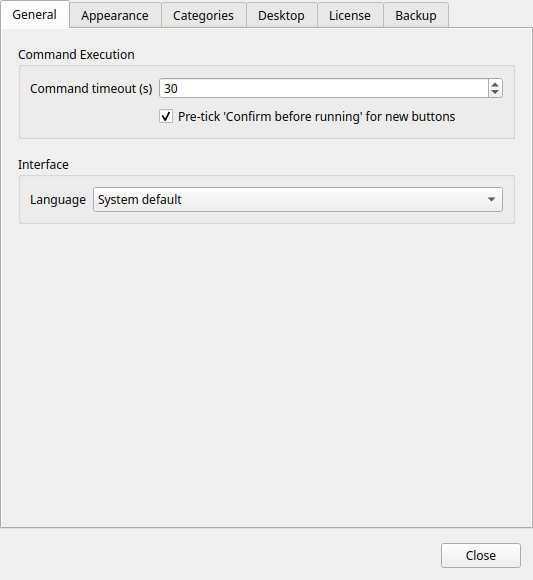
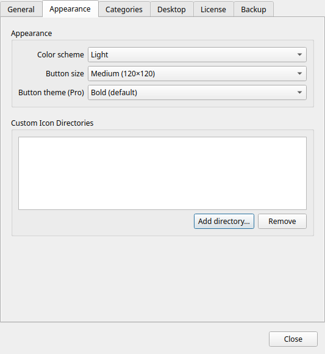
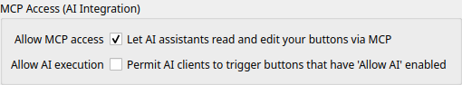
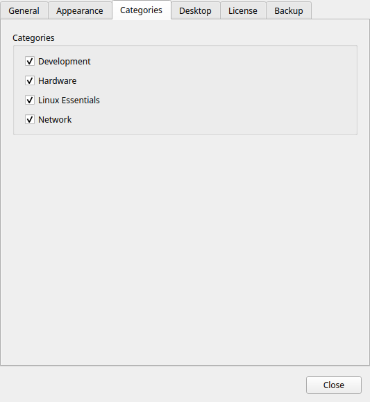

# Preferencias

Abre las Preferencias desde el menú o con `Ctrl+,`.

Los ajustes se guardan en cuanto los cambias: no hay ningún botón de guardar.

---

## General

### Idioma

Elige el idioma de la interfaz. Commandeck habla 12 idiomas:

| Código | Idioma |
|--------|--------|
| Sistema | Sigue el idioma de tu escritorio (por defecto) |
| en | Inglés |
| fr | Francés |
| de | Alemán |
| es | Español |
| it | Italiano |
| pt | Portugués |
| ru | Ruso |
| ko | Coreano |
| ja | Japonés |
| zh | Chino (simplificado) |
| ar | Árabe |
| hi | Hindi |

!!! note
    El cambio de idioma se aplica al reiniciar Commandeck. Un aviso emergente te lo recuerda.

### Tiempo máximo de un comando

El tiempo máximo (en segundos) que se espera a que un comando termine antes de cancelarlo. Por defecto: **30 segundos**.

Súbelo para comandos que se sabe que tardan (copias de archivos grandes, actualizaciones del sistema). Bájalo para que falle rápido con máquinas inalcanzables.

### Disposición de la cuadrícula

No hay ningún ajuste de «botones por fila»: la cuadrícula se recoloca sola según el ancho de la ventana. Cambia el tamaño de la ventana para tener más o menos columnas (hasta una sola). Para cambiar el tamaño de las casillas, usa **Tamaño de botón**, en [Aspecto de los botones](#button-appearance).

### Confirmar antes de ejecutar, por defecto

Cuando está activado, la casilla **Confirmar antes de ejecutar** del editor de botones viene ya marcada en cada botón nuevo que crees.

No afecta a los botones que ya existen.

---

## Aspecto de los botones

### Tamaño de botón

Fija el tamaño de todas las casillas a la vez.

| Tamaño | Dimensiones de la casilla | Tamaño del icono |
|--------|---------------------------|------------------|
| Pequeño | 80 × 80 px | 20 px |
| Mediano | 120 × 120 px | 32 px |
| Grande | 160 × 160 px | 48 px |

### Tema de botones

!!! tip "Función Pro"
    Los temas de botones requieren [Commandeck Pro](../pro.md). En la versión gratuita se queda fijo en **Bold** (el estilo por defecto).

Aplica un estilo visual a todas las casillas. Consulta [Temas](../pro/themes.md) para ver una descripción completa y capturas de cada opción.

| Tema | Estilo |
|------|--------|
| Bold | Casillas de color sólido con mucho contraste (por defecto) |
| Phone | Casillas compactas y planas, con aire de teclado telefónico |
| Neon | Fondo oscuro con bordes luminosos de color |
| Retro | Monocromo inspirado en las terminales antiguas, con líneas de barrido |

---

## Integración con el escritorio

### Siempre visible

Cuando está activado, la ventana de Commandeck flota por encima de todas las demás.

- **Windows, macOS y Linux/X11**: funciona sin más, sin ninguna dependencia extra.
- **Linux/Wayland**: el protocolo Wayland no permite a una aplicación ponerse encima por su cuenta, así que la opción aparece desactivada con su explicación. (La mayoría de sesiones X11, incluida la que trae Linux Mint por defecto, no se ven afectadas.)

!!! tip "Mantener Commandeck arriba en Wayland"
    Aunque la opción de la aplicación esté desactivada, puedes fijar la ventana igualmente: **clic derecho en la barra de título de la ventana y elige _Siempre encima_**. Eso lo ofrece el gestor de ventanas de tu escritorio, que sí tiene permiso para hacerlo. Otra opción es iniciar sesión en una sesión **X11 / «Xorg»** desde la pantalla de acceso, donde la opción de Commandeck funciona con normalidad.

Este ajuste también está en el menú, como interruptor rápido.

### Arrancar al iniciar sesión

Cuando está activado, Commandeck se abre solo al iniciar sesión en tu escritorio. Esto escribe un archivo `.desktop` en `~/.config/autostart/commandeck.desktop`.

Al desactivarlo se borra ese archivo.

### Terminal

Algunos botones abren una **ventana de terminal** para herramientas interactivas (como `btop` o `ncdu`). Commandeck detecta tu terminal automáticamente, pero si tu distribución trae una poco común puedes elegirla aquí.

- **Automático (detectar)**: la opción por defecto; Commandeck usa la primera terminal instalada que reconoce, y respeta la variable de entorno `$TERMINAL` si está definida.
- **_(una terminal concreta)_**: la lista muestra las terminales que encuentra instaladas en tu sistema. También puedes escribir el comando de cualquier otra.

### Permitir el acceso MCP

Activa el servidor MCP (Model Context Protocol) integrado. Con él en marcha, un asistente de IA compatible (Claude Desktop, Cursor, etc.) puede leer y gestionar tus botones.

Desactivado de fábrica. Consulta [Integración con IA (MCP)](../pro/mcp.md) para la configuración.

!!! warning
    Con el acceso MCP activado, tu asistente de IA puede crear, modificar y borrar botones. Desactívalo cuando no lo estés usando.

---

## Categorías

Enumera todas las categorías que existen ahora mismo en tu configuración de botones. Cada fila tiene un interruptor:

- **Activada**: la categoría aparece en el desplegable de la barra superior y sus botones se ven en la cuadrícula
- **Desactivada**: la categoría y sus botones se esconden de la cuadrícula (pero no se borran)

Es la forma de recuperar una categoría después de esconderla con clic derecho → **Ocultar la categoría**.

La lista se actualiza sola a medida que añades o quitas categorías.

---

## Perfiles de ejecución *(Pro)*

Gestiona contextos de ejecución con nombre desde el menú → **Gestionar perfiles** (también accesible desde esta sección). Cada perfil reúne:

- **Nombre del perfil**: una etiqueta corta y descriptiva (por ejemplo, `Como www-data en /var/www`)
- **Ejecutar como**: el usuario de destino: tu usuario actual (sin sudo), root o un nombre de usuario concreto
- **Carpeta de trabajo**: la carpeta a la que ir con `cd` antes de ejecutar el comando
- **Contraseña de sudo**: guardada en local con un cifrado atado a la máquina; se pasa automáticamente a `sudo -S` en el momento, así que no aparece ninguna petición en una terminal

Asigna un perfil a un botón en el [editor de botones](button-editor.md#execution-profile) para aplicar sus ajustes.

!!! tip "Función Pro"
    Los perfiles de ejecución requieren [Commandeck Pro](../pro.md).

---

## Licencia

Gestiona tu licencia de Commandeck Pro.

### Activar

1. Compra una licencia en la [página de Commandeck Pro](../pro.md)
2. Pega tu clave de licencia en el campo
3. Pulsa **Activar Pro**

Para la activación inicial hace falta conexión a internet.

### Datos de la licencia activa

Cuando hay una licencia válida activa, esta sección muestra:

- **Tipo de licencia**: Pro (pago único)
- **Número de activaciones**: por ejemplo, *1 / 3*
- **Estado**: activa

### Desactivar

Pulsa **Desactivar la licencia** para quitar la licencia Pro de este dispositivo. Los límites de la versión gratuita se aplican de inmediato.

No se borra nada. Tus botones se quedan: los botones locales son ilimitados en la versión gratuita. Solo se bloquean las funciones exclusivas de Pro: las máquinas SSH dejan de ejecutarse (sus botones siguen ahí, pero no pueden lanzarse en remoto), los temas propios vuelven al de por defecto, y la copia de seguridad y el servidor MCP dejan de estar disponibles.
