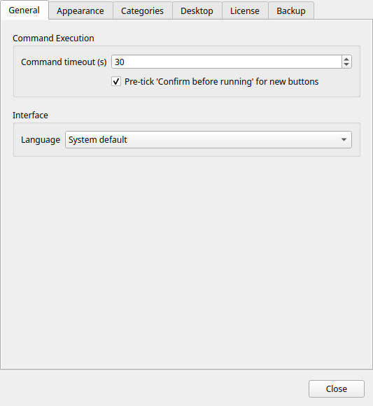
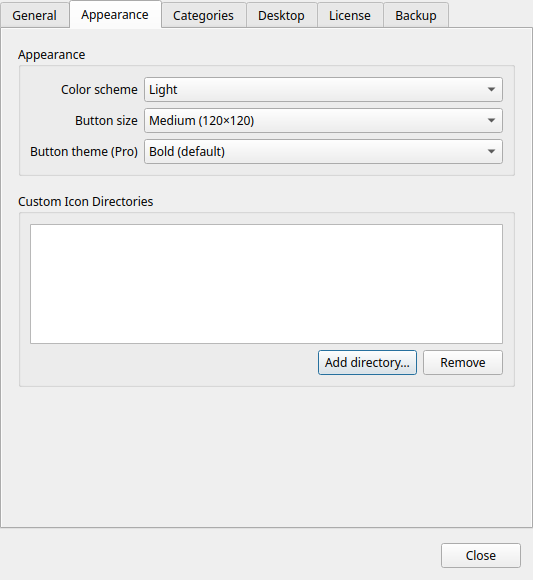
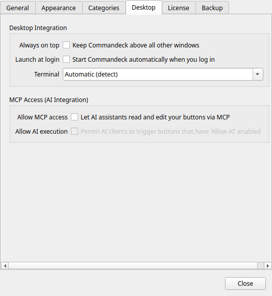
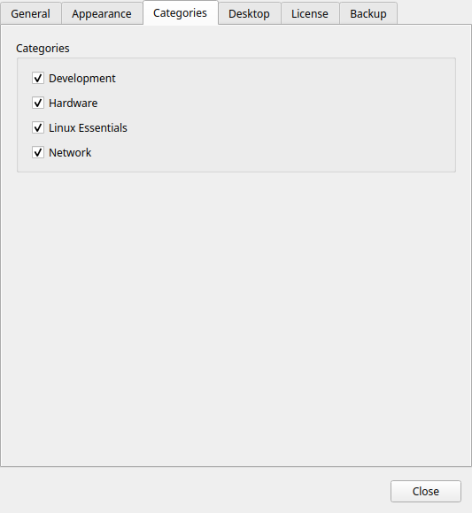
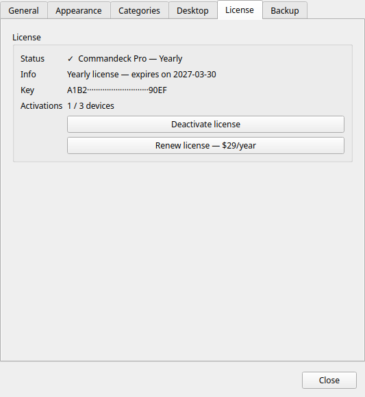

# Preferences

Open Preferences from the hamburger menu or with `Ctrl+,`.

Settings are saved immediately when you change them — there is no Save button.

---

## General

### Language

Selects the interface language. Commandeck supports 12 languages:

| Code | Language |
|------|----------|
| System | Follow your desktop locale (default) |
| en | English |
| fr | French |
| de | German |
| es | Spanish |
| it | Italian |
| pt | Portuguese |
| ru | Russian |
| ko | Korean |
| ja | Japanese |
| zh | Chinese (Simplified) |
| ar | Arabic |
| hi | Hindi |

!!! note
    A language change takes effect after restarting Commandeck. A toast notification reminds you.

### Command timeout

The maximum time (in seconds) to wait for a command to finish before cancelling it. Default: **30 seconds**.

Increase this for commands that are expected to take a long time (large file copies, system updates). Decrease it to fail fast on unreachable machines.

### Button grid layout

There is no "buttons per row" setting — the grid reflows automatically to fit the window width. Resize the window for more or fewer columns (down to a single column). To change how big the tiles are, use **Button size** under [Button Appearance](#button-appearance).

### Confirm before running by default

When enabled, the **Confirm before running** toggle in the Button Editor is pre-checked for every new button you create.

Does not affect existing buttons.

---

## Button Appearance

### Button size

Sets the size of all button tiles globally.

| Size | Tile dimensions | Icon size |
|------|----------------|-----------|
| Small | 80 × 80 px | 20 px |
| Medium | 120 × 120 px | 32 px |
| Large | 160 × 160 px | 48 px |

### Button theme

!!! tip "Pro feature"
    Button themes require [Commandeck Pro](../pro.md). On the free tier this is locked to **Bold** (system default).

Applies a visual style to all button tiles. See [Themes](../pro/themes.md) for a full description and screenshots of each option.

| Theme | Style |
|-------|-------|
| Bold | Solid colored tiles with strong contrast (default) |
| Phone | Compact flat tiles, reminiscent of a dial pad |
| Neon | Dark background with glowing accent borders |
| Retro | Terminal-inspired monochrome with scanlines |

---

## Desktop Integration

### Always on top

When enabled, the Commandeck window floats above all other windows.

- **Windows, macOS, and Linux/X11** — works out of the box, no extra dependency.
- **Linux/Wayland** — the Wayland protocol does not let an application force itself on top, so the option is disabled with an explanation. (Most X11 sessions, including the default on Linux Mint, are unaffected.)

!!! tip "Keeping Commandeck on top on Wayland"
    Even when the in-app toggle is disabled, you can still pin the window: **right-click the window's title bar and choose _Always on Top_**. Your desktop's window manager provides this and is allowed to do it. Alternatively, log in to an **X11 / "Xorg"** session at the login screen, where Commandeck's own toggle works normally.

This setting is also accessible from the hamburger menu as a quick toggle.

### Launch at login

When enabled, Commandeck starts automatically when you log in to your desktop. This writes a `.desktop` file to `~/.config/autostart/commandeck.desktop`.

Disabling it removes the autostart file.

### Terminal

Some buttons open a **terminal window** for interactive tools (like `btop` or `ncdu`). Commandeck auto-detects your terminal, but if your distribution ships an unusual one, you can choose it here.

- **Automatic (detect)** — the default; Commandeck uses the first installed terminal it recognises, and honours the `$TERMINAL` environment variable if set.
- **_(a specific terminal)_** — the list shows the terminals found installed on your system. You can also type the command of any other terminal.

### Allow MCP access

Enables the built-in MCP (Model Context Protocol) server. When active, a compatible AI assistant (Claude Desktop, Cursor, etc.) can read and manage your buttons.

Disabled by default. See [AI Integration (MCP)](../pro/mcp.md) for setup instructions.

!!! warning
    When MCP access is enabled, your AI assistant can create, modify, and delete buttons. Disable this toggle when not in use.

---

## Categories

Lists all categories that currently exist in your button configuration. Each row has a toggle:

- **Enabled** — the category appears in the header-bar category dropdown and its buttons appear in the grid
- **Disabled** — the category and its buttons are hidden from the grid (but not deleted)

This is the way to restore a category after hiding it with right-click → **Hide category**.

The list updates automatically as you add or remove categories.

---

## Execution Profiles *(Pro)*

Manage named execution contexts from the hamburger menu → **Manage Profiles** (also accessible from this section). Each profile combines:

- **Profile name** — a short descriptive label (e.g. `As www-data in /var/www`)
- **Run as** — the target user: current user (no sudo), root, or a custom username
- **Working directory** — the directory to `cd` into before running the command
- **Sudo password** — stored locally with machine-specific encoding; passed automatically to `sudo -S` at runtime so no terminal prompt appears

Assign a profile to a button in the [Button Editor](button-editor.md#execution-profile) to apply its settings.

!!! tip "Pro feature"
    Execution profiles require [Commandeck Pro](../pro.md).

---

## License

Manages your Commandeck Pro license.

### Activating

1. Purchase a license at [commandeck pro page](../pro.md)
2. Paste your license key in the field
3. Click **Activate Pro**

An internet connection is required for the initial activation.

### Active license display

When a valid license is active, this section shows:

- **License type** — Pro (one-time purchase)
- **Activation count** — e.g. *1 / 3*
- **Status** — Active

### Deactivating

Click **Deactivate license** to remove the Pro license from this device. Free tier limits apply immediately.

Nothing is deleted. Your buttons stay — local buttons are unlimited on the free tier. Only Pro-only features lock until you reactivate: SSH machines stop running (their buttons remain but can't execute remotely), custom themes revert to the default, and backup/restore and the MCP server become unavailable.
