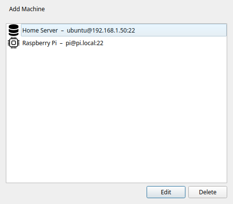
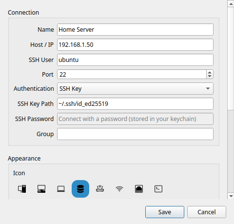
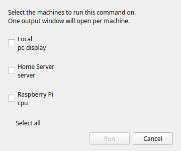

# Máquinas SSH

!!! tip "Función Pro"
    Las máquinas SSH requieren [Commandeck Pro](../pro.md).

Commandeck se conecta a servidores remotos por SSH. Puedes identificarte con una **clave SSH** (recomendado) o con una **contraseña**. Si eliges la contraseña, se guarda en el llavero seguro de tu sistema operativo: nunca en texto claro dentro de un archivo de configuración, y nunca dentro de una copia de seguridad.

---

## Gestionar las máquinas

Abre **Menú → Gestionar máquinas** para ver la lista completa. Desde ahí puedes añadir, editar y borrar máquinas.

!!! note
    La entrada **Gestionar máquinas** está bloqueada en la versión gratuita.

---

## Detectar máquinas en la red

En vez de escribir una dirección IP a mano, pulsa **Detectar** en el diálogo de gestión de máquinas. Commandeck recorre tu red local buscando aparatos que acepten conexiones SSH (puerto 22) y enumera los que encuentra.

1. Commandeck rellena solo la **subred** de tu red (por ejemplo `192.168.1.`). Si tus máquinas están en otro rango — una VPN, o un router que usa `192.168.0.` — cambia ese campo y pulsa **Buscar**.
2. Elige un aparato de los resultados y pulsa **Añadir esta máquina**. El formulario se abre con la dirección IP y el nombre ya puestos: solo tienes que indicar el usuario SSH y la clave, y luego **Probar** y **Guardar**.

Las máquinas que ya has añadido se ocultan de los resultados, así que solo se te ofrecen aparatos nuevos.

!!! tip "Para que salgan los nombres de los aparatos"
    Commandeck intenta averiguar el nombre de cada aparato automáticamente, en este orden: DNS inverso, luego **mDNS / Bonjour** (los nombres `.local` que anuncian los Mac, las Raspberry Pi con avahi y casi todos los NAS) y después **NetBIOS** (Windows y Samba). Los aparatos que no se anuncian — normalmente servidores sin pantalla y contenedores Docker — solo muestran su dirección IP.

    Para que esos también tengan nombre, tu router o tu DNS tiene que responder a las consultas inversas de tu red local. En **OPNsense / pfSense con Unbound**, activa *Register DHCP leases* y *Register DHCP static mappings*. Si delante de Unbound hay un filtro de DNS como **AdGuard Home** o Pi-hole, apunta sus *servidores de DNS inverso privado* al resolvedor Unbound para que las consultas `PTR` privadas obtengan respuesta. Compruébalo desde una terminal con `getent hosts <ip>`: en cuanto devuelva el nombre, vuelve a buscar y Commandeck también lo mostrará.

!!! note
    La detección encuentra aparatos con el SSH (puerto 22) abierto. Un aparato protegido por un cortafuegos puede no aparecer aunque tenga SSH.

---

## Diálogo de añadir máquina

Pulsa **+** en el diálogo de máquinas para abrir el formulario.

### Nombre

Un nombre visible que solo se usa dentro de Commandeck. Elige algo descriptivo: lo verás en los editores de botones y en el selector de máquina.

Ejemplos: `Servidor Plex`, `Pi-hole`, `Servidor del trabajo`, `NAS`

### Anfitrión / IP

La dirección IP o el nombre de la máquina remota. Tiene que ser alcanzable desde tu ordenador por la red.

Ejemplos: `192.168.1.50`, `plex.local`, `miservidor.ejemplo.com`

### Usuario SSH

El nombre de usuario con el que entrar en la máquina remota.

Ejemplos: `pi`, `ubuntu`, `admin`, `tunombre`

### Puerto

El puerto SSH. Por defecto es el **22**. Cámbialo solo si tu servidor usa un puerto distinto del habitual.

### Autenticación

Elige cómo entra Commandeck en esta máquina:

- **Clave SSH** *(recomendado)*: usa un archivo de clave privada (mira [Ruta de la clave SSH](#ssh-key-path), más abajo). Una vez configurada, no hay nada que escribir ni que guardar.
- **Contraseña**: se conecta con una contraseña que Commandeck guarda en el llavero de tu sistema (mira [Contraseña SSH](#ssh-password), más abajo).

Las claves SSH son la opción más segura y más cómoda: una vez configuradas, no vuelves a escribir ninguna contraseña. La autenticación por contraseña está ahí para los servidores donde no puedes instalar una clave.

### Ruta de la clave SSH

La ruta al archivo de clave privada que se usa para identificarse.

Ejemplos: `~/.ssh/id_rsa`, `~/.ssh/id_ed25519`, `~/.ssh/clave_miservidor`

Si el campo está vacío, Commandeck recurre a tu agente SSH o a la clave por defecto (`~/.ssh/id_rsa`).

!!! note
    Las claves con frase de paso necesitan un `ssh-agent` en marcha con la clave cargada. Si la clave está bloqueada, Commandeck muestra un error claro: no te pedirá la frase de paso de forma interactiva.

### Contraseña SSH

Solo se usa cuando la **autenticación** está puesta en **Contraseña**. Escribe la contraseña de acceso del usuario remoto; Commandeck la guarda y la usa en cada conexión a esta máquina. Usa **Probar** para comprobar que funciona antes de guardar.

!!! info "Dónde se guarda tu contraseña"
    Las contraseñas guardadas viven en el llavero seguro de tu sistema operativo — **GNOME Keyring / KWallet** en Linux, **Llavero** en macOS, **Administrador de credenciales** en Windows — cifradas en reposo. **Nunca** se escriben en los archivos de configuración de Commandeck ni se incluyen en una copia de seguridad.

    Si no hay ningún llavero disponible (por ejemplo, en una máquina Linux mínima o sin pantalla), Commandeck recurre a un archivo local cifrado de forma sencilla (`.secrets`, que solo tu cuenta puede leer) y te avisa de que eso no es un cifrado fuerte. En ese caso, es mejor una clave SSH.

### Icono

Un icono que aparece junto al nombre de la máquina en el selector y en la lista. Hay seis: ordenador de sobremesa, portátil, servidor, router, punto de acceso wifi y un aparato genérico.

---

## Preparar la clave SSH

Si todavía no tienes un par de claves SSH, Commandeck puede generarlo por ti y copiar la clave pública al servidor:

1. Pulsa **Generar clave SSH**: Commandeck crea un par de claves Ed25519 en `~/.ssh/`
2. Pulsa **Copiar la clave al servidor**: escribe tu contraseña una vez (no se guarda). Por dentro se usa `ssh-copy-id`
3. A partir de ahí, las conexiones usan la clave automáticamente, sin contraseña

---

## Probar la conexión

Pulsa **Probar** en el diálogo de la máquina. Commandeck ejecuta `echo commandeck-ok` en el anfitrión remoto. Un mensaje verde confirma que la conexión funciona. Si falla, se muestra el error completo de SSH.

Haz la prueba después de añadir una máquina y cada vez que cambies las credenciales.

---

## Asignar máquinas a un botón

En el [editor de botones](button-editor.md), la sección **Máquinas de destino** muestra tus máquinas como interruptores. Activa las que quieras.

---

## El selector de máquina

Cuando un botón tiene dos o más destinos activados, al pulsarlo se abre el selector de máquina.

El selector enumera cada destino activado. Elige uno y pulsa **Ejecutar**. El comando se ejecuta solo en la máquina elegida.

!!! tip
    Si quieres ejecutar en todas las máquinas de una vez sin elegir, puedes crear un botón por máquina, o usar la selección múltiple para ejecutarlos uno detrás de otro.

---

## Modos de salida por SSH

Los tres modos de ejecución funcionan por SSH:

| Modo | Comportamiento |
|------|----------------|
| **Silencioso** | El resultado aparece como un aviso emergente |
| **Mostrar la salida** | El texto normal y el de errores del equipo remoto se muestran en una ventana cuando el comando termina |
| **Abrir en terminal** | Commandeck genera un comando `ssh -t` y lo abre en tu emulador de terminal: sesión interactiva completa |
