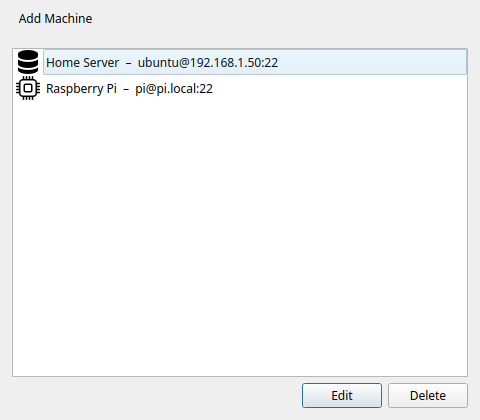
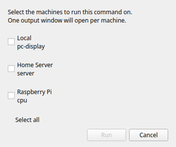

# Machines SSH

!!! tip "Fonctionnalité Pro"
    Les machines SSH nécessitent [Commandeck Pro](../pro.md).

Commandeck se connecte aux serveurs distants en SSH. Vous pouvez vous authentifier soit avec une **clé SSH** (recommandé), soit avec un **mot de passe**. Si vous choisissez le mot de passe, celui-ci est conservé dans le trousseau sécurisé de votre système d'exploitation — jamais en clair dans un fichier de configuration, et jamais inclus dans une sauvegarde.

---

## Gestion des machines

Ouvrez **Menu → Gérer les machines** pour voir la liste complète des machines. Depuis cette fenêtre, vous pouvez ajouter, modifier et supprimer des machines.

!!! note
    L'élément de menu **Gérer les machines** est verrouillé dans la version gratuite.

---

## Boîte de dialogue Ajouter une machine

Cliquez sur **+** dans la boîte de dialogue Machines pour ouvrir le formulaire Ajouter une machine.

### Nom

Un nom d'affichage utilisé uniquement dans Commandeck. Choisissez quelque chose de descriptif — vous verrez ce nom dans les éditeurs de boutons et dans le sélecteur de machine.

Exemples : `Serveur Plex`, `Pi-hole`, `VPS Pro`, `NAS`

### Hôte / IP

L'adresse IP ou le nom d'hôte de la machine distante. Elle doit être accessible depuis votre ordinateur sur le réseau.

Exemples : `192.168.1.50`, `plex.local`, `monserveur.exemple.com`

### Utilisateur SSH

Le nom d'utilisateur pour se connecter sur la machine distante.

Exemples : `pi`, `ubuntu`, `admin`, `votrenom`

### Port

Le port SSH. Par défaut : **22**. Modifiez ce champ uniquement si votre serveur utilise SSH sur un port non standard.

### Authentification

Choisissez comment Commandeck se connecte à cette machine :

- **Clé SSH** *(recommandé)* — utilise un fichier de clé privée (voir [Chemin de la clé SSH](#chemin-de-la-cle-ssh) ci-dessous). Plus rien à saisir ni à stocker une fois configuré.
- **Mot de passe** — se connecter avec un mot de passe que Commandeck conserve dans le trousseau de votre système (voir [Mot de passe SSH](#mot-de-passe-ssh) ci-dessous).

Les clés SSH sont l'option la plus sûre et la plus pratique — une fois configurées, vous ne saisissez plus jamais de mot de passe. L'authentification par mot de passe est prévue pour les serveurs où vous ne pouvez pas installer de clé.

### Chemin de la clé SSH

Le chemin vers le fichier de clé privée utilisé pour l'authentification.

Exemples : `~/.ssh/id_rsa`, `~/.ssh/id_ed25519`, `~/.ssh/cle_monserveur`

Si le champ est vide, Commandeck utilise votre agent SSH ou la clé par défaut (`~/.ssh/id_rsa`).

!!! note
    Les clés avec une phrase de passe nécessitent un `ssh-agent` en cours d'exécution avec la clé chargée. Si la clé est verrouillée, Commandeck affiche un message d'erreur clair — il ne demandera pas la phrase de passe de manière interactive.

### Mot de passe SSH

Utilisé uniquement lorsque **Authentification** est réglé sur **Mot de passe**. Saisissez le mot de passe de connexion de l'utilisateur distant ; Commandeck l'enregistre et l'utilise à chaque connexion à cette machine. Utilisez **Tester** pour vérifier que le mot de passe fonctionne avant d'enregistrer.

!!! info "Où votre mot de passe est stocké"
    Les mots de passe enregistrés résident dans le trousseau sécurisé de votre système d'exploitation — **GNOME Keyring / KWallet** sous Linux, **Trousseau** sous macOS, **Gestionnaire d'identifiants** sous Windows — chiffrés au repos. Ils ne sont **jamais** écrits dans les fichiers de configuration de Commandeck ni **jamais** inclus dans une sauvegarde.

    Si aucun trousseau système n'est disponible (par exemple une machine Linux minimale ou sans interface), Commandeck se rabat sur un fichier local obfusqué (`.secrets`, lisible uniquement par votre compte) et vous avertit que ce n'est pas un chiffrement fort. Dans ce cas, préférez une clé SSH.

### Icône

Une icône visuelle affichée à côté du nom de la machine dans le sélecteur et la liste des machines. Six icônes sont disponibles : bureau, ordinateur portable, serveur, routeur, point d'accès Wi-Fi et un appareil générique.

---

## Configuration des clés SSH

Si vous n'avez pas encore de paire de clés SSH, Commandeck peut en générer une pour vous et copier la clé publique sur le serveur :

1. Cliquez sur **Générer une clé SSH** — Commandeck crée une paire de clés Ed25519 dans `~/.ssh/`
2. Cliquez sur **Copier la clé sur le serveur** — saisissez votre mot de passe une seule fois (il n'est pas stocké). Cela exécute `ssh-copy-id` en interne
3. Les connexions futures utilisent automatiquement la clé, sans mot de passe

---

## Test de la connexion

Cliquez sur **Tester** dans la boîte de dialogue de la machine. Commandeck exécute `echo commandeck-ok` sur l'hôte distant. Un message vert confirme que la connexion fonctionne. En cas d'échec, l'erreur complète de SSH est affichée.

Effectuez le test après l'ajout d'une machine et à chaque modification des informations d'identification.

---

## Assigner des machines à un bouton

Dans l'[Éditeur de bouton](button-editor.md), la section **Machines cibles** affiche vos machines sous forme de boutons bascule. Activez les machines souhaitées.

---

## Le sélecteur de machine

Lorsqu'un bouton a deux cibles ou plus activées, un clic dessus ouvre la boîte de dialogue du sélecteur de machine.

Le sélecteur liste chaque cible activée. Sélectionnez-en une et cliquez sur **Exécuter**. La commande s'exécute uniquement sur la machine sélectionnée.

!!! tip
    Si vous souhaitez exécuter sur toutes les machines à la fois sans choisir, vous pouvez le faire en créant des boutons séparés par machine, ou en utilisant la sélection multiple pour les exécuter en séquence.

---

## Modes de sortie via SSH

Les trois modes d'exécution fonctionnent via SSH :

| Mode | Comportement |
|------|--------------|
| **Silencieux** | Le résultat est affiché sous forme de notification toast |
| **Afficher la sortie** | Le `stdout`/`stderr` distant est affiché dans une boîte de dialogue après la fin de la commande |
| **Ouvrir dans le terminal** | Commandeck génère une commande `ssh -t` et l'ouvre dans votre émulateur de terminal — session interactive complète |
